# OOP Fundamentals for LLD

## Table of Contents
1. [Four Pillars of OOP](#four-pillars-of-oop)
2. [Class Relationships](#class-relationships)
3. [Abstraction vs Implementation](#abstraction-vs-implementation)
4. [Interface vs Abstract Class](#interface-vs-abstract-class)

---

## Four Pillars of OOP

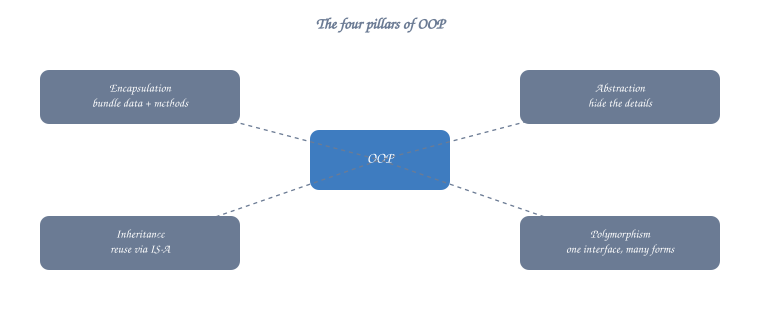

### 1. Encapsulation
**Definition**: Bundling data and methods that operate on that data within a single unit (class), hiding internal details.


<details class="ascii-diagram">
<summary>ASCII diagram</summary>
<pre><code>┌─────────────────────────────┐
│      BankAccount            │
├─────────────────────────────┤
│ - accountNumber: string     │ ← Private (Hidden)
│ - balance: double           │ ← Private (Hidden)
├─────────────────────────────┤
│ + deposit(amount): void     │ ← Public (Interface)
│ + withdraw(amount): bool    │ ← Public (Interface)
│ + getBalance(): double      │ ← Public (Interface)
└─────────────────────────────┘</code></pre>
</details>

**Key Benefits**:
- Data hiding and protection
- Controlled access through methods
- Easy to modify internal implementation
- Validation logic in one place

### 2. Inheritance
**Definition**: Mechanism where a new class inherits properties and behaviors from an existing class.

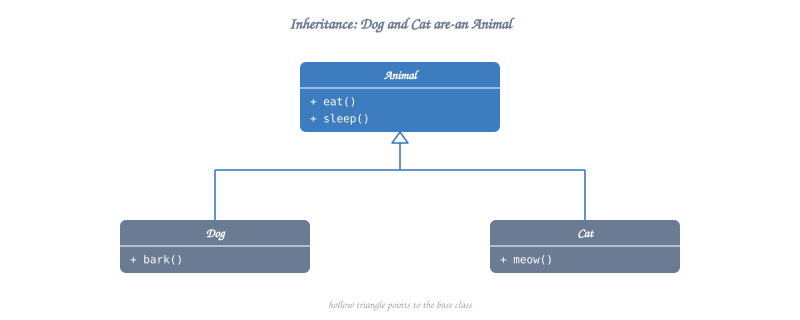

<details class="ascii-diagram">
<summary>ASCII diagram</summary>
<pre><code>              ┌──────────────┐
              │   Vehicle    │
              ├──────────────┤
              │ + start()    │
              │ + stop()     │
              └──────┬───────┘
                     │ (inherits)
          ┌──────────┴──────────┐
          ▼                     ▼
    ┌──────────┐          ┌──────────┐
    │   Car    │          │   Bike   │
    ├──────────┤          ├──────────┤
    │ + drive()│          │ + pedal()│
    └──────────┘          └──────────┘</code></pre>
</details>

**Types**:
- **Single**: Class inherits from one base class
- **Multiple**: Class inherits from multiple base classes (C++ supports this)
- **Multilevel**: Chain of inheritance (A → B → C)
- **Hierarchical**: Multiple classes inherit from one base class

### 3. Polymorphism
**Definition**: Ability of objects to take multiple forms. Same interface, different implementations.

**Types**:

a) **Compile-time (Static) Polymorphism**
   - Function Overloading
   - Operator Overloading
   - Templates

b) **Runtime (Dynamic) Polymorphism**
   - Virtual Functions
   - Function Overriding

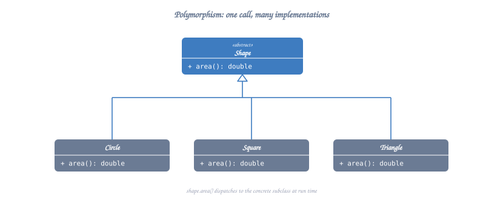

<details class="ascii-diagram">
<summary>ASCII diagram</summary>
<pre><code>┌─────────────────────┐
│      Shape          │
├─────────────────────┤
│ + draw(): void = 0  │ ← Pure virtual (interface)
└──────────┬──────────┘
           │
    ┌──────┴──────┬──────────┐
    ▼             ▼          ▼
┌─────────┐  ┌─────────┐  ┌─────────┐
│ Circle  │  │ Square  │  │Triangle │
├─────────┤  ├─────────┤  ├─────────┤
│ +draw() │  │ +draw() │  │ +draw() │
└─────────┘  └─────────┘  └─────────┘

Usage:
Shape* shape = new Circle();
shape-&gt;draw();  // Calls Circle's draw() - Runtime polymorphism</code></pre>
</details>

### 4. Abstraction
**Definition**: Hiding complex implementation details and showing only essential features.

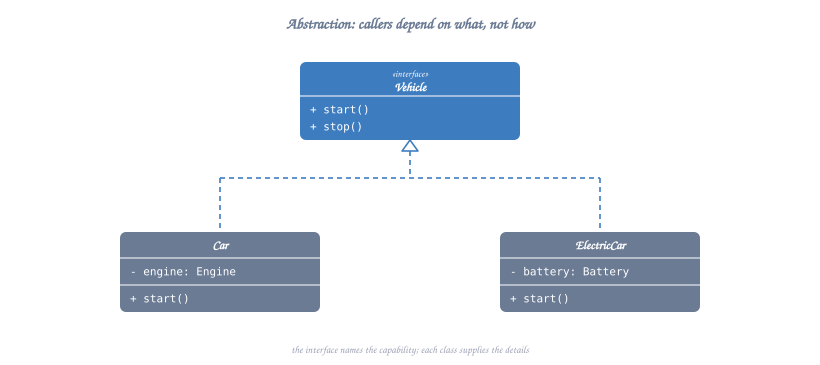

<details class="ascii-diagram">
<summary>ASCII diagram</summary>
<pre><code>┌────────────────────────┐
│   PaymentProcessor     │ ← Abstract Interface
├────────────────────────┤
│ + processPayment()     │
│ + refund()             │
└────────────┬───────────┘
             │
    ┌────────┴────────┬─────────────┐
    ▼                 ▼             ▼
┌─────────┐     ┌─────────┐   ┌─────────┐
│ Credit  │     │  PayPal │   │ Bitcoin │
│  Card   │     │         │   │         │
└─────────┘     └─────────┘   └─────────┘</code></pre>
</details>

---

## Class Relationships

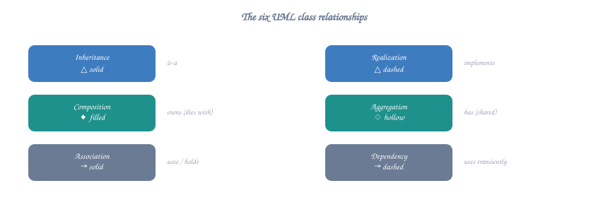

### 1. Association
**Definition**: "Uses-a" relationship. One class uses another class.

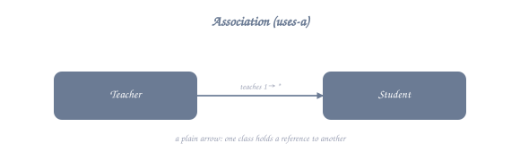

<details class="ascii-diagram">
<summary>ASCII diagram</summary>
<pre><code>┌──────────┐           ┌──────────┐
│ Teacher  │ ────────&gt; │ Student  │
│          │  teaches  │          │
└──────────┘           └──────────┘</code></pre>
</details>

**Characteristics**:
- Loose coupling
- Both can exist independently
- May be bidirectional

### 2. Aggregation
**Definition**: "Has-a" relationship (weak). Whole-part relationship where parts can exist independently.

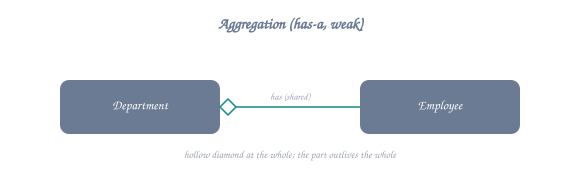

<details class="ascii-diagram">
<summary>ASCII diagram</summary>
<pre><code>┌────────────┐           ┌──────────┐
│ Department │ ◇────────&gt;│ Employee │
│            │  has      │          │
└────────────┘           └──────────┘</code></pre>
</details>

**Characteristics**:
- Part can exist without whole
- Weak ownership
- Empty diamond notation

**Example**: Department has Employees, but Employees can exist without Department.

### 3. Composition
**Definition**: "Has-a" relationship (strong). Whole-part relationship where parts cannot exist without whole.

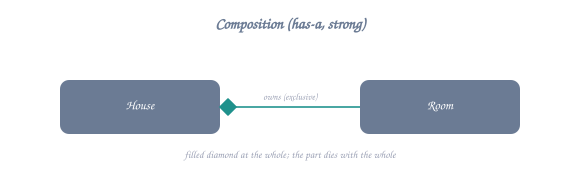

<details class="ascii-diagram">
<summary>ASCII diagram</summary>
<pre><code>┌──────┐           ┌──────┐
│ Car  │ ◆────────&gt;│Engine│
│      │  has      │      │
└──────┘           └──────┘</code></pre>
</details>

**Characteristics**:
- Part cannot exist without whole
- Strong ownership
- Filled diamond notation
- Lifecycle bound to parent

**Example**: Car has Engine. If Car is destroyed, Engine is destroyed.

### 4. Inheritance (IS-A)


<details class="ascii-diagram">
<summary>ASCII diagram</summary>
<pre><code>┌──────────┐
│  Animal  │
└────▲─────┘
     │ (is-a)
     │
┌────┴─────┐
│   Dog    │
└──────────┘</code></pre>
</details>

### 5. Dependency
**Definition**: Weakest relationship. One class depends on another temporarily.

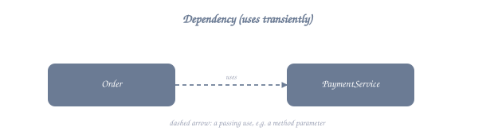

<details class="ascii-diagram">
<summary>ASCII diagram</summary>
<pre><code>┌──────────┐           ┌──────────┐
│  Client  │ - - - - -&gt;│  Server  │
│          │   uses    │          │
└──────────┘           └──────────┘</code></pre>
</details>

**Example**: Method parameter, local variable, or return type.

---

## Abstraction vs Implementation

### Abstract Class vs Concrete Class

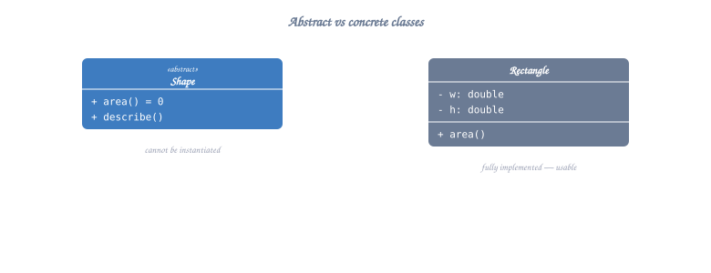

<details class="ascii-diagram">
<summary>ASCII diagram</summary>
<pre><code>┌───────────────────────────┐
│   AbstractAnimal          │ ← Cannot instantiate
├───────────────────────────┤
│ # name: string            │
│ + eat(): void = 0         │ ← Pure virtual (must implement)
│ + sleep(): void {...}     │ ← Concrete method (can override)
└─────────────┬─────────────┘
              │
              ▼
┌───────────────────────────┐
│   Dog                     │ ← Can instantiate
├───────────────────────────┤
│ + eat(): void {...}       │ ← Must implement
│ + bark(): void {...}      │ ← Additional method
└───────────────────────────┘</code></pre>
</details>

**When to use Abstract Class**:
- Share code among related classes
- Define common interface with some implementation
- Have protected members
- Have non-static or non-final fields

---

## Interface vs Abstract Class

### Interface (Pure Abstract Class in C++)

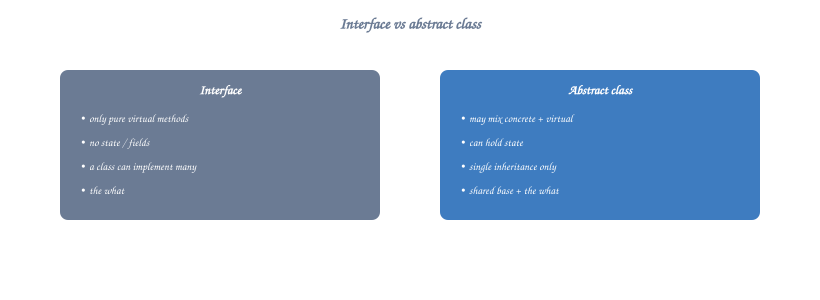

<details class="ascii-diagram">
<summary>ASCII diagram</summary>
<pre><code>┌───────────────────────────┐
│   IFlyable                │ ← Interface
├───────────────────────────┤
│ + fly(): void = 0         │ ← All methods pure virtual
│ + land(): void = 0        │
└─────────────┬─────────────┘
              │
       ┌──────┴──────┐
       ▼             ▼
┌──────────┐   ┌──────────┐
│   Bird   │   │ Airplane │
└──────────┘   └──────────┘</code></pre>
</details>

### Comparison Table

| Aspect | Interface | Abstract Class |
|--------|-----------|----------------|
| Methods | All pure virtual | Can have concrete methods |
| Fields | Only static const | Can have instance fields |
| Constructor | No | Yes |
| Multiple Inheritance | Yes (C++ allows) | Yes (C++ allows) |
| Purpose | Contract definition | Partial implementation |

### C++ Example

```cpp
// Interface
class IShape {
public:
    virtual ~IShape() = default;
    virtual double area() const = 0;
    virtual double perimeter() const = 0;
    virtual void draw() const = 0;
};

// Abstract Class
class Shape {
protected:
    std::string color;
    
public:
    Shape(const std::string& c) : color(c) {}
    virtual ~Shape() = default;
    
    // Pure virtual (must implement)
    virtual double area() const = 0;
    
    // Concrete method (can override)
    virtual void display() const {
        std::cout << "Shape with color: " << color << std::endl;
    }
    
    std::string getColor() const { return color; }
};
```

---

## Key Design Decisions

### When to use what?

**Use Interface when**:
- Defining a contract/capability (Flyable, Serializable)
- Multiple unrelated classes need same behavior
- Support multiple interface implementation

**Use Abstract Class when**:
- Classes share common code
- Need to provide default behavior
- Need protected members or state

**Use Composition over Inheritance when**:
- "Has-a" relationship is more natural than "Is-a"
- Need flexibility to change behavior at runtime
- Want to avoid tight coupling

**Use Inheritance when**:
- Clear "Is-a" relationship exists
- Need to leverage polymorphism
- Extending existing class behavior

---

## Quick Reference

### UML Notation Summary

```
┌─────────────────────────────────────┐
│ Relationship   │ Symbol  │ Example  │
├────────────────┼─────────┼──────────┤
│ Association    │  ────>  │ uses     │
│ Aggregation    │  ◇───>  │ has      │
│ Composition    │  ◆───>  │ owns     │
│ Inheritance    │  ───▷   │ is-a     │
│ Implementation │  ─ ─▷   │ realizes │
│ Dependency     │ ┄┄┄┄>   │ depends  │
└─────────────────────────────────────┘
```

### Access Specifiers in C++

```
┌──────────┬─────────┬──────────┬─────────────┐
│ Modifier │ Class   │ Package  │ Subclass    │
├──────────┼─────────┼──────────┼─────────────┤
│ private  │   ✓     │    ✗     │      ✗      │
│protected │   ✓     │    ✗     │      ✓      │
│ public   │   ✓     │    ✓     │      ✓      │
└──────────┴─────────┴──────────┴─────────────┘
```

---

**Next**: Continue to `02-solid-principles.md` to learn about SOLID design principles.

