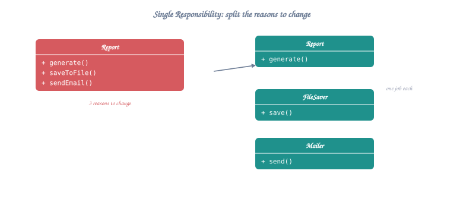
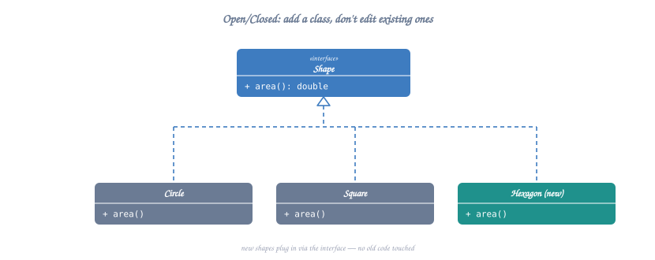
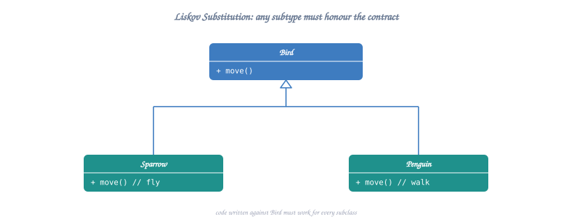
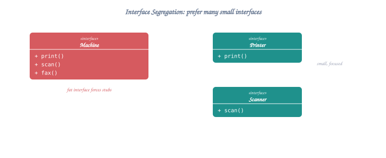
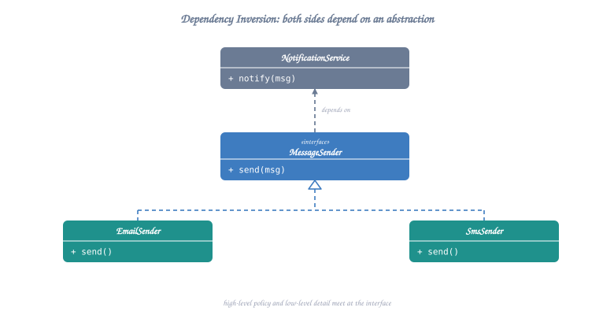
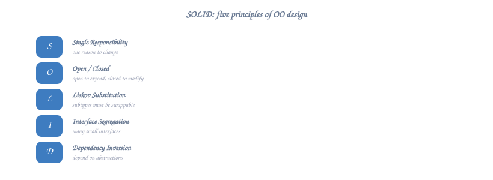

# SOLID Principles - The Foundation of Good Design

## Table of Contents
1. [Single Responsibility Principle (SRP)](#1-single-responsibility-principle-srp)
2. [Open/Closed Principle (OCP)](#2-openclosed-principle-ocp)
3. [Liskov Substitution Principle (LSP)](#3-liskov-substitution-principle-lsp)
4. [Interface Segregation Principle (ISP)](#4-interface-segregation-principle-isp)
5. [Dependency Inversion Principle (DIP)](#5-dependency-inversion-principle-dip)

---

## 1. Single Responsibility Principle (SRP)

**Definition**: A class should have only ONE reason to change. Each class should have a single, well-defined responsibility.

### ❌ Bad Example - Multiple Responsibilities

```cpp
class Employee {
private:
    string name;
    double salary;
    
public:
    // Responsibility 1: Employee data management
    void setName(const string& n) { name = n; }
    double calculateSalary() { return salary * 12; }
    
    // Responsibility 2: Database operations - WRONG!
    void saveToDatabase() {
        // DB code here
    }
    
    // Responsibility 3: Report generation - WRONG!
    void generatePaySlip() {
        // PDF generation code
    }
    
    // Responsibility 4: Email notification - WRONG!
    void sendPaySlipEmail() {
        // Email sending code
    }
};
```

**Problems**:
- Change in DB structure affects Employee class
- Change in email service affects Employee class
- Change in report format affects Employee class
- Hard to test, reuse, and maintain

### ✅ Good Example - Single Responsibility



<details class="ascii-diagram">
<summary>ASCII diagram</summary>
<pre><code>┌──────────────┐
│   Employee   │───────────────────────────────┐
├──────────────┤                               │
│ - name       │                               │
│ - salary     │                               │
│ + calculate()│                               │
└──────────────┘                               │
                                               │
┌────────────────────┐  ┌──────────────────┐   │
│ EmployeeRepository │  │ PaySlipGenerator │   │
├────────────────────┤  ├──────────────────┤   │
│ + save()           │  │ + generate()     │   │
│ + find()           │  └──────────────────┘   │
│ + delete()         │                         │
└────────────────────┘  ┌──────────────────┐   │
                        │ EmailService     │   │
                        ├──────────────────┤   │
                        │ + send()         │◄──┘
                        └──────────────────┘</code></pre>
</details>

```cpp
// Single Responsibility: Employee data and business logic
class Employee {
private:
    string name;
    string id;
    double salary;
    
public:
    Employee(const string& n, const string& i, double s) 
        : name(n), id(i), salary(s) {}
    
    double calculateAnnualSalary() const { return salary * 12; }
    string getName() const { return name; }
    string getId() const { return id; }
    double getSalary() const { return salary; }
};

// Single Responsibility: Database operations
class EmployeeRepository {
public:
    void save(const Employee& emp) {
        // Database save logic
    }
    
    Employee* findById(const string& id) {
        // Database query logic
    }
};

// Single Responsibility: Report generation
class PaySlipGenerator {
public:
    string generate(const Employee& emp) {
        // Report generation logic
        return "PaySlip for " + emp.getName();
    }
};

// Single Responsibility: Email operations
class EmailService {
public:
    void send(const string& to, const string& content) {
        // Email sending logic
    }
};
```

**Benefits**:
- Each class has one reason to change
- Easy to test each component
- Easy to reuse (e.g., EmailService for other purposes)
- Better organization and maintainability

---

## 2. Open/Closed Principle (OCP)

**Definition**: Software entities should be OPEN for extension but CLOSED for modification.

### ❌ Bad Example - Modification Required

```cpp
class PaymentProcessor {
public:
    void processPayment(const string& type, double amount) {
        if (type == "credit") {
            // Process credit card
        } else if (type == "paypal") {
            // Process PayPal
        } else if (type == "bitcoin") {  // Adding new type requires modification
            // Process Bitcoin
        }
        // Every new payment method requires modifying this class!
    }
};
```

**Problems**:
- Must modify existing code for new payment methods
- Risk breaking existing functionality
- Violates OCP

### ✅ Good Example - Extension Without Modification



<details class="ascii-diagram">
<summary>ASCII diagram</summary>
<pre><code>┌─────────────────────────┐
│   PaymentProcessor      │ ← Abstract (Interface)
├─────────────────────────┤
│ + process(amount): void │
└───────────┬─────────────┘
            │
      ┌─────┴─────┬─────────────┬─────────────┐
      ▼           ▼             ▼             ▼
┌──────────┐ ┌──────────┐ ┌──────────┐ ┌──────────┐
│ Credit   │ │  PayPal  │ │ Bitcoin  │ │   New    │
│   Card   │ │          │ │          │ │ Payment  │← Add without modifying existing
└──────────┘ └──────────┘ └──────────┘ └──────────┘</code></pre>
</details>

```cpp
// Abstract base class (interface)
class PaymentProcessor {
public:
    virtual ~PaymentProcessor() = default;
    virtual bool process(double amount) = 0;
    virtual string getPaymentType() const = 0;
};

// Concrete implementations
class CreditCardProcessor : public PaymentProcessor {
private:
    string cardNumber;
    
public:
    bool process(double amount) override {
        cout << "Processing credit card payment: $" << amount << endl;
        // Credit card processing logic
        return true;
    }
    
    string getPaymentType() const override { return "Credit Card"; }
};

class PayPalProcessor : public PaymentProcessor {
private:
    string email;
    
public:
    bool process(double amount) override {
        cout << "Processing PayPal payment: $" << amount << endl;
        // PayPal processing logic
        return true;
    }
    
    string getPaymentType() const override { return "PayPal"; }
};

class BitcoinProcessor : public PaymentProcessor {
private:
    string walletAddress;
    
public:
    bool process(double amount) override {
        cout << "Processing Bitcoin payment: $" << amount << endl;
        // Bitcoin processing logic
        return true;
    }
    
    string getPaymentType() const override { return "Bitcoin"; }
};

// Client code - No modification needed for new payment types!
class ShoppingCart {
private:
    PaymentProcessor* processor;
    
public:
    void setPaymentProcessor(PaymentProcessor* p) {
        processor = p;
    }
    
    void checkout(double amount) {
        processor->process(amount);
    }
};
```

**Benefits**:
- Add new payment methods without modifying existing code
- Reduced risk of breaking existing functionality
- Better testability

---

## 3. Liskov Substitution Principle (LSP)

**Definition**: Objects of a superclass should be replaceable with objects of its subclasses without breaking the application.

### ❌ Bad Example - Violates LSP

```cpp
class Bird {
public:
    virtual void fly() {
        cout << "Flying..." << endl;
    }
};

class Sparrow : public Bird {
    // Can fly - OK
};

class Ostrich : public Bird {
public:
    void fly() override {
        throw runtime_error("Can't fly!"); // Violates LSP!
    }
};

// This code breaks!
void makeBirdFly(Bird* bird) {
    bird->fly(); // Crashes if bird is Ostrich
}
```

**Problem**: Ostrich is a Bird but doesn't behave like one. Substituting Bird with Ostrich breaks the code.

### ✅ Good Example - Follows LSP



<details class="ascii-diagram">
<summary>ASCII diagram</summary>
<pre><code>┌──────────┐
│   Bird   │
├──────────┤
│ + eat()  │
└────┬─────┘
     │
     ├─────────────┐
     ▼             ▼
┌──────────┐  ┌──────────┐
│ Flying   │  │Flightless│
│  Bird    │  │  Bird    │
├──────────┤  ├──────────┤
│ + fly()  │  │ + walk() │
└────┬─────┘  └────┬─────┘
     │             │
     ▼             ▼
┌─────────┐   ┌─────────┐
│ Sparrow │   │ Ostrich │
└─────────┘   └─────────┘</code></pre>
</details>

```cpp
// Base class - only common behavior
class Bird {
public:
    virtual ~Bird() = default;
    virtual void eat() {
        cout << "Eating..." << endl;
    }
};

// Specialized class for birds that can fly
class FlyingBird : public Bird {
public:
    virtual void fly() {
        cout << "Flying..." << endl;
    }
};

// Specialized class for flightless birds
class FlightlessBird : public Bird {
public:
    virtual void walk() {
        cout << "Walking..." << endl;
    }
};

// Concrete implementations
class Sparrow : public FlyingBird {
    // Inherits fly() - correct behavior
};

class Ostrich : public FlightlessBird {
    // Inherits walk() - correct behavior
    // No fly() method - correct!
};

// Now substitution works correctly
void feedBird(Bird* bird) {
    bird->eat(); // Works for all birds
}

void makeFly(FlyingBird* bird) {
    bird->fly(); // Only accepts birds that can fly
}
```

**Benefits**:
- Subclasses truly extend behavior without violating contracts
- No unexpected behavior or exceptions
- Type system enforces correct usage

---

## 4. Interface Segregation Principle (ISP)

**Definition**: Clients should not be forced to depend on interfaces they don't use. Many small, specific interfaces are better than one large, general interface.

### ❌ Bad Example - Fat Interface

```cpp
class IWorker {
public:
    virtual void work() = 0;
    virtual void eat() = 0;
    virtual void sleep() = 0;
    virtual void getSalary() = 0;
};

class HumanWorker : public IWorker {
public:
    void work() override { /* ... */ }
    void eat() override { /* ... */ }
    void sleep() override { /* ... */ }
    void getSalary() override { /* ... */ }
};

class RobotWorker : public IWorker {
public:
    void work() override { /* ... */ }
    void eat() override { /* Not applicable! */ }
    void sleep() override { /* Not applicable! */ }
    void getSalary() override { /* Not applicable! */ }
};
```

**Problem**: RobotWorker is forced to implement methods it doesn't need.

### ✅ Good Example - Segregated Interfaces



<details class="ascii-diagram">
<summary>ASCII diagram</summary>
<pre><code>┌────────────┐    ┌────────────┐    ┌────────────┐
│ IWorkable  │    │  IEatable  │    │ ISleepable │
├────────────┤    ├────────────┤    ├────────────┤
│ + work()   │    │ + eat()    │    │ + sleep()  │
└─────┬──────┘    └─────┬──────┘    └─────┬──────┘
      │                 │                 │
      └─────────┬───────┴─────────────────┘
                │
         ┌──────▼──────┐
         │ HumanWorker │ (implements all 3)
         └─────────────┘

┌────────────┐
│ IWorkable  │
├────────────┤
│ + work()   │
└─────┬──────┘
      │
      ▼
┌─────────────┐
│ RobotWorker │ (implements only what it needs)
└─────────────┘</code></pre>
</details>

```cpp
// Small, focused interfaces
class IWorkable {
public:
    virtual ~IWorkable() = default;
    virtual void work() = 0;
};

class IEatable {
public:
    virtual ~IEatable() = default;
    virtual void eat() = 0;
};

class ISleepable {
public:
    virtual ~ISleepable() = default;
    virtual void sleep() = 0;
};

class IPayable {
public:
    virtual ~IPayable() = default;
    virtual double getSalary() = 0;
};

// Human implements all applicable interfaces
class HumanWorker : public IWorkable, public IEatable, 
                    public ISleepable, public IPayable {
public:
    void work() override {
        cout << "Human working..." << endl;
    }
    
    void eat() override {
        cout << "Human eating..." << endl;
    }
    
    void sleep() override {
        cout << "Human sleeping..." << endl;
    }
    
    double getSalary() override {
        return 50000.0;
    }
};

// Robot only implements what it needs
class RobotWorker : public IWorkable {
public:
    void work() override {
        cout << "Robot working 24/7..." << endl;
    }
};

// Manager only implements relevant interfaces
class Manager : public IWorkable, public IPayable {
public:
    void work() override {
        cout << "Managing team..." << endl;
    }
    
    double getSalary() override {
        return 80000.0;
    }
};
```

**Benefits**:
- Classes only implement what they need
- No dummy or not-applicable implementations
- More flexible and maintainable
- Easier to understand and test

---

## 5. Dependency Inversion Principle (DIP)

**Definition**: 
1. High-level modules should not depend on low-level modules. Both should depend on abstractions.
2. Abstractions should not depend on details. Details should depend on abstractions.

### ❌ Bad Example - Tight Coupling

```cpp
// Low-level module
class MySQLDatabase {
public:
    void connect() {
        cout << "Connecting to MySQL..." << endl;
    }
    
    void save(const string& data) {
        cout << "Saving to MySQL: " << data << endl;
    }
};

// High-level module directly depends on low-level
class UserService {
private:
    MySQLDatabase db; // Tight coupling!
    
public:
    void createUser(const string& username) {
        db.connect();
        db.save(username);
    }
};
```

**Problems**:
- UserService is tightly coupled to MySQLDatabase
- Cannot switch to PostgreSQL or MongoDB without modifying UserService
- Hard to test (need real database)

### ✅ Good Example - Depend on Abstractions



<details class="ascii-diagram">
<summary>ASCII diagram</summary>
<pre><code>        ┌──────────────────┐
        │   UserService    │ ← High-level
        └────────┬─────────┘
                 │ depends on
                 ▼
        ┌──────────────────┐
        │    IDatabase     │ ← Abstraction
        └────────┬─────────┘
                 │ implemented by
        ┌────────┴────────┬──────────┬──────────┐
        ▼                 ▼          ▼          ▼
┌──────────────┐  ┌──────────────┐  ┌──────────────┐
│MySQLDatabase │  │PostgresqlDB  │  │  MongoDb     │
└──────────────┘  └──────────────┘  └──────────────┘
     ▲ Low-level modules</code></pre>
</details>

```cpp
// Abstraction (interface)
class IDatabase {
public:
    virtual ~IDatabase() = default;
    virtual void connect() = 0;
    virtual void save(const string& data) = 0;
    virtual void query(const string& sql) = 0;
};

// Low-level implementations
class MySQLDatabase : public IDatabase {
public:
    void connect() override {
        cout << "Connecting to MySQL..." << endl;
    }
    
    void save(const string& data) override {
        cout << "Saving to MySQL: " << data << endl;
    }
    
    void query(const string& sql) override {
        cout << "MySQL query: " << sql << endl;
    }
};

class PostgreSQLDatabase : public IDatabase {
public:
    void connect() override {
        cout << "Connecting to PostgreSQL..." << endl;
    }
    
    void save(const string& data) override {
        cout << "Saving to PostgreSQL: " << data << endl;
    }
    
    void query(const string& sql) override {
        cout << "PostgreSQL query: " << sql << endl;
    }
};

class MongoDBDatabase : public IDatabase {
public:
    void connect() override {
        cout << "Connecting to MongoDB..." << endl;
    }
    
    void save(const string& data) override {
        cout << "Saving to MongoDB: " << data << endl;
    }
    
    void query(const string& sql) override {
        cout << "MongoDB query: " << sql << endl;
    }
};

// High-level module depends on abstraction
class UserService {
private:
    IDatabase* database; // Depends on abstraction!
    
public:
    // Dependency Injection via constructor
    UserService(IDatabase* db) : database(db) {}
    
    void createUser(const string& username) {
        database->connect();
        database->save(username);
    }
    
    void findUser(const string& id) {
        database->query("SELECT * FROM users WHERE id=" + id);
    }
};

// Usage - Easy to switch implementations
int main() {
    // Use MySQL
    IDatabase* mysqlDb = new MySQLDatabase();
    UserService userService1(mysqlDb);
    userService1.createUser("john_doe");
    
    // Switch to PostgreSQL - No changes to UserService!
    IDatabase* postgresDb = new PostgreSQLDatabase();
    UserService userService2(postgresDb);
    userService2.createUser("jane_doe");
    
    // Switch to MongoDB - No changes to UserService!
    IDatabase* mongoDb = new MongoDBDatabase();
    UserService userService3(mongoDb);
    userService3.createUser("bob_smith");
    
    delete mysqlDb;
    delete postgresDb;
    delete mongoDb;
    
    return 0;
}
```

**Benefits**:
- Loose coupling between modules
- Easy to switch implementations
- Easy to test with mock objects
- More flexible and maintainable

---

## SOLID Summary



<details class="ascii-diagram">
<summary>ASCII diagram</summary>
<pre><code>┌──────────────────────────────────────────────────────────────┐
│ Principle │ Key Question                                     │
├───────────┼──────────────────────────────────────────────────┤
│ SRP       │ Does this class have only one reason to change?  │
│ OCP       │ Can I add features without modifying existing?   │
│ LSP       │ Can I substitute parent with child safely?       │
│ ISP       │ Are interfaces small and focused?                │
│ DIP       │ Do I depend on abstractions, not concretions?    │
└──────────────────────────────────────────────────────────────┘</code></pre>
</details>

### Real-world Analogy

```
SRP: A chef cooks, a waiter serves, a cashier bills
     → Don't make chef do everything

OCP: Power outlets accept new devices without modification
     → Extend through plugs, don't modify outlet

LSP: Any car can use any gas station
     → Subtype should work where parent works

ISP: TV remote vs Universal remote
     → Specific interfaces for specific needs

DIP: Plug into socket (abstraction), not into power plant (concrete)
     → Depend on interfaces, not implementations
```

---

**Next**: Continue to `03-uml-diagrams.md` to learn about visual design representation.

