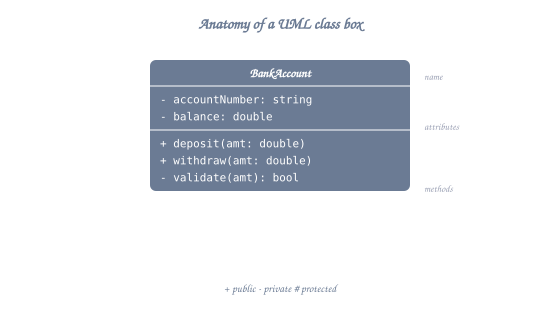
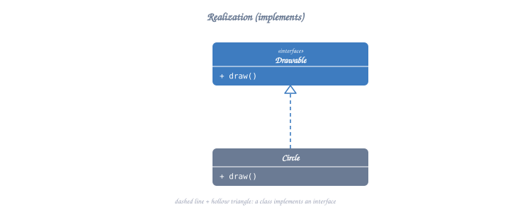
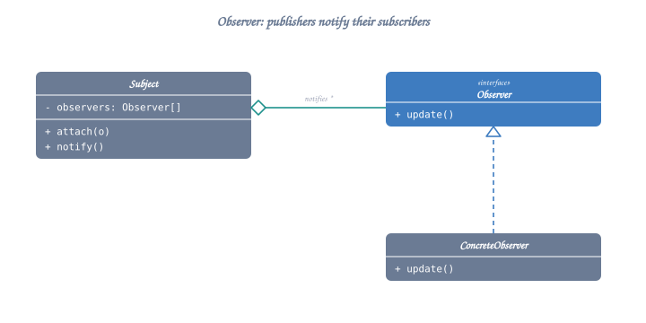

# UML Class Diagrams for LLD

## Table of Contents
1. [What is UML?](#what-is-uml)
2. [Class Diagram Basics](#class-diagram-basics)
3. [Relationships](#relationships)
4. [Advanced Notations](#advanced-notations)
5. [Complete Examples](#complete-examples)

---

## What is UML?

**UML (Unified Modeling Language)** is a standardized visual language for documenting, specifying, and designing software systems.

**Why Use UML in LLD?**
- Visual communication of design
- Clear representation of class structures
- Show relationships between components
- Universal language understood by all developers

---

## Class Diagram Basics

### Simple Class Structure



<details class="ascii-diagram">
<summary>ASCII diagram</summary>
<pre><code>┌─────────────────────────┐
│      ClassName          │  ← Class name (mandatory)
├─────────────────────────┤
│ - privateField: type    │  ← Attributes/Fields
│ # protectedField: type  │
│ + publicField: type     │
├─────────────────────────┤
│ - privateMethod()       │  ← Methods/Operations
│ # protectedMethod()     │
│ + publicMethod()        │
└─────────────────────────┘</code></pre>
</details>

### Visibility Symbols

| Symbol | Visibility | Description |
|--------|-----------|-------------|
| `+` | Public | Accessible from anywhere |
| `-` | Private | Only accessible within class |
| `#` | Protected | Accessible in class and subclasses |
| `~` | Package | Accessible within same package |

### Example: Bank Account

```
┌──────────────────────────────┐
│       BankAccount            │
├──────────────────────────────┤
│ - accountNumber: string      │
│ - balance: double            │
│ - owner: string              │
├──────────────────────────────┤
│ + BankAccount(owner: string) │  ← Constructor
│ + deposit(amount: double)    │
│ + withdraw(amount: double)   │
│ + getBalance(): double       │
│ - validateAmount(amt: double)│
└──────────────────────────────┘
```

---

## Relationships


### 1. Association (Uses-A)

**Notation**: Solid line with arrow `────>`


<details class="ascii-diagram">
<summary>ASCII diagram</summary>
<pre><code>┌──────────┐           ┌──────────┐
│ Teacher  │ ────────&gt; │ Student  │
│          │  teaches  │          │
└──────────┘           └──────────┘</code></pre>
</details>

**Multiplicity**:
```
┌──────────┐         1      *  ┌──────────┐
│ Teacher  │ ─────────────────>│ Student  │
│          │    teaches        │          │
└──────────┘                   └──────────┘

1     = exactly one
0..1  = zero or one
*     = zero or many
1..*  = one or many
2..5  = two to five
```

**C++ Implementation**:
```cpp
class Student {
    string name;
};

class Teacher {
private:
    vector<Student*> students;  // Association
public:
    void addStudent(Student* s) {
        students.push_back(s);
    }
};
```

---

### 2. Aggregation (Has-A, Weak)

**Notation**: Hollow diamond `◇────>`


<details class="ascii-diagram">
<summary>ASCII diagram</summary>
<pre><code>┌────────────┐           ┌──────────┐
│ Department │ ◇────────&gt;│ Employee │
│            │  has      │          │
└────────────┘           └──────────┘</code></pre>
</details>

**Characteristics**:
- Part can exist independently of whole
- Weak ownership
- Shared lifecycle

**C++ Implementation**:
```cpp
class Employee {
    string name;
public:
    Employee(const string& n) : name(n) {}
};

class Department {
private:
    vector<Employee*> employees;  // Aggregation (weak)
public:
    void addEmployee(Employee* e) {
        employees.push_back(e);
    }
    // Department destroyed, employees still exist
};
```

---

### 3. Composition (Has-A, Strong)

**Notation**: Filled diamond `◆────>`


<details class="ascii-diagram">
<summary>ASCII diagram</summary>
<pre><code>┌──────┐           ┌──────┐
│ Car  │ ◆────────&gt;│Engine│
│      │  owns     │      │
└──────┘           └──────┘</code></pre>
</details>

**Characteristics**:
- Part cannot exist without whole
- Strong ownership
- Bound lifecycle

**C++ Implementation**:
```cpp
class Engine {
    int cylinders;
public:
    Engine(int c) : cylinders(c) {}
};

class Car {
private:
    Engine engine;  // Composition (owns)
public:
    Car() : engine(4) {}  // Engine created with Car
    // Car destroyed, engine destroyed
};
```

---

### 4. Inheritance (Is-A)

**Notation**: Hollow triangle `───▷`


<details class="ascii-diagram">
<summary>ASCII diagram</summary>
<pre><code>┌──────────────┐
│    Animal    │
├──────────────┤
│ + eat()      │
│ + sleep()    │
└──────┬───────┘
       │
   ┌───┴────────┬──────────┐
   │            │          │
   ▼            ▼          ▼
┌──────┐   ┌──────┐   ┌──────┐
│ Dog  │   │ Cat  │   │ Bird │
├──────┤   ├──────┤   ├──────┤
│+bark()│   │+meow()│   │+fly()│
└──────┘   └──────┘   └──────┘</code></pre>
</details>

**C++ Implementation**:
```cpp
class Animal {
public:
    virtual void eat() { cout << "Eating..." << endl; }
    virtual void sleep() { cout << "Sleeping..." << endl; }
};

class Dog : public Animal {
public:
    void bark() { cout << "Woof!" << endl; }
};

class Cat : public Animal {
public:
    void meow() { cout << "Meow!" << endl; }
};
```

---

### 5. Realization/Implementation

**Notation**: Dashed line with hollow triangle `┄┄▷`



<details class="ascii-diagram">
<summary>ASCII diagram</summary>
<pre><code>┌──────────────┐
│  &lt;&lt;interface&gt;&gt;│
│   IShape     │
├──────────────┤
│ + draw()     │
│ + area()     │
└──────┬───────┘
       ┆
   ┌───┴────────┬──────────┐
   ┆            ┆          ┆
   ▼            ▼          ▼
┌──────┐   ┌──────┐   ┌──────┐
│Circle│   │Square│   │Triangle│
└──────┘   └──────┘   └──────┘</code></pre>
</details>

**C++ Implementation**:
```cpp
class IShape {
public:
    virtual ~IShape() = default;
    virtual void draw() = 0;
    virtual double area() = 0;
};

class Circle : public IShape {
public:
    void draw() override { /* ... */ }
    double area() override { /* ... */ }
};
```

---

### 6. Dependency

**Notation**: Dashed arrow `┄┄┄>`


<details class="ascii-diagram">
<summary>ASCII diagram</summary>
<pre><code>┌──────────┐           ┌──────────┐
│  Client  │ ┄┄┄┄┄┄┄&gt; │  Server  │
│          │   uses    │          │
└──────────┘           └──────────┘</code></pre>
</details>

**When to use**:
- Method parameter
- Local variable
- Return type
- Temporary usage

**C++ Implementation**:
```cpp
class Server {
public:
    void handleRequest() { /* ... */ }
};

class Client {
public:
    void sendRequest(Server* server) {  // Dependency
        server->handleRequest();
    }
};
```

---

## Advanced Notations

### Abstract Classes


<details class="ascii-diagram">
<summary>ASCII diagram</summary>
<pre><code>┌─────────────────────────┐
│  &lt;&lt;abstract&gt;&gt;           │
│      Animal             │
├─────────────────────────┤
│ # name: string          │
├─────────────────────────┤
│ + eat(): void = 0       │  ← Pure virtual (italic)
│ + getName(): string     │
└─────────────────────────┘</code></pre>
</details>

**Alternative notation** (italics for abstract):
```
┌─────────────────────────┐
│      Animal             │
├─────────────────────────┤
│ # name: string          │
├─────────────────────────┤
│ + eat(): void           │  (shown in italics)
└─────────────────────────┘
```

---

### Static Members

```
┌─────────────────────────┐
│      Counter            │
├─────────────────────────┤
│ - count: int            │  (underlined = static)
├─────────────────────────┤
│ + increment(): void     │  (underlined = static)
│ + getCount(): int       │  (underlined = static)
└─────────────────────────┘
```

---

### Stereotypes

Common stereotypes:
- `<<interface>>` - Pure interface
- `<<abstract>>` - Abstract class
- `<<enum>>` - Enumeration
- `<<singleton>>` - Singleton pattern
- `<<utility>>` - Utility class

```
┌─────────────────────────┐
│    <<singleton>>        │
│       Logger            │
├─────────────────────────┤
│ - instance: Logger*     │  (static)
│ - Logger()              │  (private)
├─────────────────────────┤
│ + getInstance(): Logger*│  (static)
│ + log(msg: string)      │
└─────────────────────────┘
```

---

## Complete Examples

### Example 1: E-Commerce System

```
┌──────────────────┐
│    Customer      │
├──────────────────┤
│ - customerId     │
│ - name           │
│ - email          │
├──────────────────┤
│ + placeOrder()   │
│ + viewOrders()   │
└────────┬─────────┘
         │
         │ 1
         │
         │ *
         ▼
┌──────────────────┐       *        *   ┌──────────────────┐
│      Order       │◆──────────────────>│    OrderItem     │
├──────────────────┤                    ├──────────────────┤
│ - orderId        │                    │ - product        │
│ - orderDate      │                    │ - quantity       │
│ - status         │                    │ - price          │
├──────────────────┤                    ├──────────────────┤
│ + calculateTotal()│                    │ + getSubtotal() │
│ + ship()         │                    └────────┬─────────┘
└──────────────────┘                             │
                                                 │ *
                                                 │
                                                 │ 1
                                                 ▼
                                        ┌──────────────────┐
                                        │     Product      │
                                        ├──────────────────┤
                                        │ - productId      │
                                        │ - name           │
                                        │ - price          │
                                        ├──────────────────┤
                                        │ + getDetails()   │
                                        └──────────────────┘
```

---

### Example 2: Banking System

```
                    ┌──────────────┐
                    │    Person    │
                    ├──────────────┤
                    │ - name       │
                    │ - address    │
                    └──────▲───────┘
                           │
                    ┌──────┴──────┐
                    │             │
             ┌──────▼─────┐  ┌────▼──────┐
             │  Customer  │  │  Employee │
             ├────────────┤  ├───────────┤
             │- customerId│  │-employeeId│
             │            │  │- role     │
             └─────┬──────┘  └───────────┘
                   │
                   │ 1
                   │
                   │ *
                   ▼
            ┌──────────────┐
            │   Account    │ ← Abstract
            ├──────────────┤
            │ - accountNo  │
            │ - balance    │
            ├──────────────┤
            │ + deposit()  │
            │ + withdraw() │ = 0
            └──────▲───────┘
                   │
          ┌────────┴────────┐
          │                 │
    ┌─────▼─────┐    ┌──────▼──────┐
    │  Checking │    │   Savings   │
    │  Account  │    │   Account   │
    ├───────────┤    ├─────────────┤
    │+withdraw()│    │- minBalance │
    │+transfer()│    │+withdraw()  │
    └───────────┘    │+addInterest()│
                     └─────────────┘
```

---

### Example 3: Library Management

```
┌───────────────┐         *        *  ┌───────────────┐
│    Member     │◇──────────────────>│     Book      │
├───────────────┤      borrows       ├───────────────┤
│ - memberId    │                    │ - isbn        │
│ - name        │                    │ - title       │
│ - email       │                    │ - author      │
├───────────────┤                    │ - available   │
│ + borrowBook()│                    ├───────────────┤
│ + returnBook()│                    │ + checkout()  │
└───────────────┘                    │ + return()    │
                                     └───────▲───────┘
                                             │
                                    ┌────────┴────────┐
                                    │                 │
                            ┌───────▼──────┐  ┌───────▼──────┐
                            │  PhysicalBook│  │  DigitalBook │
                            ├──────────────┤  ├──────────────┤
                            │- location    │  │- downloadUrl │
                            │- condition   │  │- fileSize    │
                            └──────────────┘  └──────────────┘


                ┌───────────────┐
                │   Librarian   │
                ├───────────────┤
                │ - employeeId  │
                ├───────────────┤
                │ + addBook()   │
                │ + removeBook()│
                └───────────────┘
```

---

## Relationship Summary

| Relationship | Symbol | Meaning | Strength | Example |
|-------------|---------|---------|----------|---------|
| **Dependency** | `┄┄┄>` | Uses temporarily | Weakest | Method parameter |
| **Association** | `────>` | Uses-a relationship | Weak | Teacher teaches Students |
| **Aggregation** | `◇──>` | Has-a (weak) | Medium | Department has Employees |
| **Composition** | `◆──>` | Owns-a (strong) | Strong | Car owns Engine |
| **Inheritance** | `───▷` | Is-a relationship | Strongest | Dog is-a Animal |
| **Realization** | `┄┄▷` | Implements interface | Strong | Circle implements IShape |

---

## Tips for Drawing Class Diagrams

### 1. Start Simple
- Begin with main classes
- Add relationships later
- Don't overcomplicate initially

### 2. Use Meaningful Names
- Clear, descriptive class names
- Follow naming conventions
- Avoid abbreviations

### 3. Show Only Relevant Details
- Don't show all methods/attributes
- Focus on design-level information
- Hide implementation details

### 4. Be Consistent
- Use same notation style
- Maintain consistent spacing
- Follow UML standards

### 5. Layout Tips
- Place parent classes above children
- Group related classes together
- Minimize crossing lines
- Keep it readable

---

## Common Patterns in UML

### Singleton Pattern


<details class="ascii-diagram">
<summary>ASCII diagram</summary>
<pre><code>┌───────────────────────┐
│   &lt;&lt;singleton&gt;&gt;       │
│      Database         │
├───────────────────────┤
│ - instance: Database* │  (static, underlined)
│ - Database()          │  (private)
├───────────────────────┤
│ + getInstance()       │  (static, underlined)
│ + query()             │
└───────────────────────┘</code></pre>
</details>

### Factory Pattern


<details class="ascii-diagram">
<summary>ASCII diagram</summary>
<pre><code>┌────────────────┐
│  &lt;&lt;interface&gt;&gt; │
│    Product     │
└────────▲───────┘
         │
    ┌────┴────┐
    │         │
┌───▼───┐ ┌───▼───┐
│ProductA│ │ProductB│
└────────┘ └────────┘
    ▲         ▲
    │         │
    └────┬────┘
         │ creates
┌────────▼────────┐
│     Factory     │
├─────────────────┤
│+createProduct() │
└─────────────────┘</code></pre>
</details>

### Observer Pattern



<details class="ascii-diagram">
<summary>ASCII diagram</summary>
<pre><code>┌──────────────┐      1      *  ┌──────────────┐
│   Subject    │◇──────────────&gt;│   Observer   │
├──────────────┤                ├──────────────┤
│- observers   │                │ + update()   │
│+ attach()    │                └──────▲───────┘
│+ detach()    │                       │
│+ notify()    │                ┌──────┴──────┐
└──────────────┘                │             │
                         ┌──────▼─────┐ ┌─────▼──────┐
                         │ConcreteObsA│ │ConcreteObsB│
                         └────────────┘ └────────────┘</code></pre>
</details>

---

## Tools for Creating UML Diagrams

**Online Tools**:
- draw.io (diagrams.net)
- Lucidchart
- PlantUML (text-based)
- Mermaid (text-based)

**Desktop Tools**:
- Visual Paradigm
- StarUML
- ArgoUML

**IDE Plugins**:
- IntelliJ IDEA (built-in)
- Visual Studio (extensions)
- VS Code (extensions)

---

## Practice Exercise

Design a UML class diagram for a **Hotel Booking System** with:
- Hotel, Room, Customer
- Booking, Payment
- Different room types (Single, Double, Suite)
- Reservation management

**Key elements to include**:
- Proper relationships
- Multiplicities
- Inheritance where appropriate
- Key methods and attributes

---

**Congratulations!** You've completed the Concepts section. You now understand:
✅ OOP Fundamentals
✅ SOLID Principles  
✅ UML Class Diagrams

**Next**: Move to `02-design-patterns/` to learn design patterns, then practice with 25 LLD problems!

