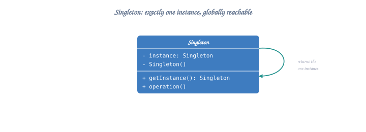
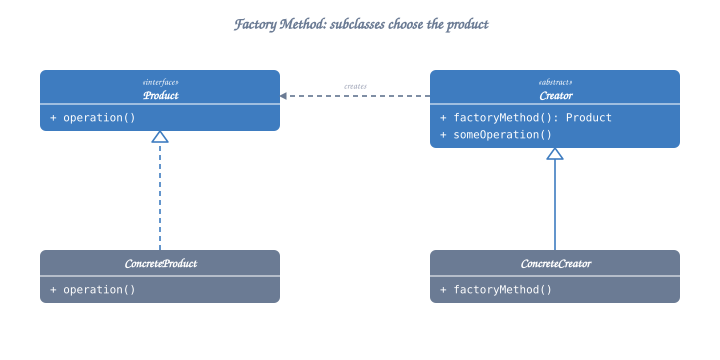
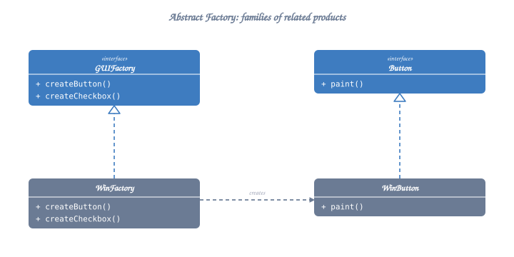
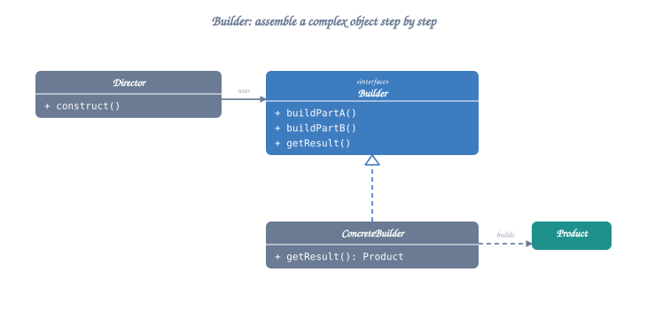
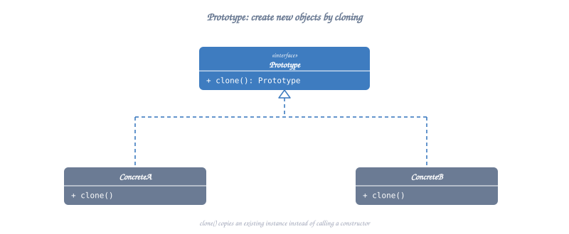

# Creational Design Patterns

Creational patterns deal with object creation mechanisms, trying to create objects in a manner suitable to the situation.

## Table of Contents
1. [Singleton Pattern](#1-singleton-pattern)
2. [Factory Method Pattern](#2-factory-method-pattern)
3. [Abstract Factory Pattern](#3-abstract-factory-pattern)
4. [Builder Pattern](#4-builder-pattern)
5. [Prototype Pattern](#5-prototype-pattern)

---

## 1. Singleton Pattern

**Intent**: Ensure a class has only ONE instance and provide a global point of access to it.

**When to Use**:
- Database connections
- Logger
- Configuration manager
- Thread pools
- Cache

### Structure



<details class="ascii-diagram">
<summary>ASCII diagram</summary>
<pre><code>┌──────────────────────┐
│     Singleton        │
├──────────────────────┤
│ - instance: Singleton│ ← Static
│ - Singleton()        │ ← Private constructor
├──────────────────────┤
│ + getInstance(): *   │ ← Static method
│ + operation()        │
└──────────────────────┘</code></pre>
</details>

### Implementation (Thread-Safe)

```cpp
#include <iostream>
#include <mutex>
#include <memory>

class Logger {
private:
    static Logger* instance;
    static std::mutex mutex_;
    
    // Private constructor
    Logger() {
        std::cout << "Logger instance created" << std::endl;
    }
    
    // Delete copy constructor and assignment
    Logger(const Logger&) = delete;
    Logger& operator=(const Logger&) = delete;
    
public:
    // Thread-safe getInstance
    static Logger* getInstance() {
        std::lock_guard<std::mutex> lock(mutex_);
        if (instance == nullptr) {
            instance = new Logger();
        }
        return instance;
    }
    
    void log(const std::string& message) {
        std::cout << "[LOG] " << message << std::endl;
    }
    
    static void destroyInstance() {
        delete instance;
        instance = nullptr;
    }
};

// Initialize static members
Logger* Logger::instance = nullptr;
std::mutex Logger::mutex_;

// Better: Modern C++11 Thread-Safe Singleton
class ModernLogger {
private:
    ModernLogger() {
        std::cout << "ModernLogger instance created" << std::endl;
    }
    
public:
    // Delete copy and move
    ModernLogger(const ModernLogger&) = delete;
    ModernLogger& operator=(const ModernLogger&) = delete;
    ModernLogger(ModernLogger&&) = delete;
    ModernLogger& operator=(ModernLogger&&) = delete;
    
    static ModernLogger& getInstance() {
        static ModernLogger instance; // Thread-safe in C++11
        return instance;
    }
    
    void log(const std::string& message) {
        std::cout << "[LOG] " << message << std::endl;
    }
};

// Usage
int main() {
    Logger* logger1 = Logger::getInstance();
    Logger* logger2 = Logger::getInstance();
    
    logger1->log("First log");
    logger2->log("Second log");
    
    std::cout << "Same instance? " << (logger1 == logger2) << std::endl; // true
    
    Logger::destroyInstance();
    
    // Modern way
    ModernLogger::getInstance().log("Modern log");
    
    return 0;
}
```

**Pros**:
- Controlled access to sole instance
- Lazy initialization
- Global access point

**Cons**:
- Difficult to unit test
- Hidden dependencies
- Can be anti-pattern if overused

---

## 2. Factory Method Pattern

**Intent**: Define an interface for creating an object, but let subclasses decide which class to instantiate.

**When to Use**:
- Class can't anticipate the type of objects it needs to create
- Class wants subclasses to specify objects to create
- Need to delegate responsibility to helper subclasses

### Structure



<details class="ascii-diagram">
<summary>ASCII diagram</summary>
<pre><code>┌────────────────┐
│    Creator     │
├────────────────┤
│ + factoryMethod│ ← Returns Product
│ + operation()  │
└────────┬───────┘
         │
    ┌────┴────┬─────────┐
    ▼         ▼         ▼
┌─────────┐ ┌─────────┐ ┌─────────┐
│Concrete │ │Concrete │ │Concrete │
│Creator A│ │Creator B│ │Creator C│
└─────────┘ └─────────┘ └─────────┘
    │         │             │
    │creates  │creates      │creates
    ▼         ▼             ▼
┌─────────┐ ┌─────────┐ ┌─────────┐
│Product A│ │Product B│ │Product C│
└─────────┘ └─────────┘ └─────────┘</code></pre>
</details>

### Implementation

```cpp
#include <iostream>
#include <memory>
#include <string>

// Product interface
class Transport {
public:
    virtual ~Transport() = default;
    virtual void deliver() const = 0;
    virtual std::string getType() const = 0;
};

// Concrete Products
class Truck : public Transport {
public:
    void deliver() const override {
        std::cout << "Delivering by land in a truck" << std::endl;
    }
    
    std::string getType() const override {
        return "Truck";
    }
};

class Ship : public Transport {
public:
    void deliver() const override {
        std::cout << "Delivering by sea in a ship" << std::endl;
    }
    
    std::string getType() const override {
        return "Ship";
    }
};

class Airplane : public Transport {
public:
    void deliver() const override {
        std::cout << "Delivering by air in an airplane" << std::endl;
    }
    
    std::string getType() const override {
        return "Airplane";
    }
};

// Creator (Factory)
class Logistics {
public:
    virtual ~Logistics() = default;
    
    // Factory Method
    virtual std::unique_ptr<Transport> createTransport() const = 0;
    
    // Business logic that uses the factory method
    void planDelivery() const {
        auto transport = createTransport();
        std::cout << "Planning delivery using " << transport->getType() << std::endl;
        transport->deliver();
    }
};

// Concrete Creators
class RoadLogistics : public Logistics {
public:
    std::unique_ptr<Transport> createTransport() const override {
        return std::make_unique<Truck>();
    }
};

class SeaLogistics : public Logistics {
public:
    std::unique_ptr<Transport> createTransport() const override {
        return std::make_unique<Ship>();
    }
};

class AirLogistics : public Logistics {
public:
    std::unique_ptr<Transport> createTransport() const override {
        return std::make_unique<Airplane>();
    }
};

// Usage
int main() {
    std::unique_ptr<Logistics> logistics;
    
    // Road delivery
    logistics = std::make_unique<RoadLogistics>();
    logistics->planDelivery();
    
    std::cout << "\n";
    
    // Sea delivery
    logistics = std::make_unique<SeaLogistics>();
    logistics->planDelivery();
    
    std::cout << "\n";
    
    // Air delivery
    logistics = std::make_unique<AirLogistics>();
    logistics->planDelivery();
    
    return 0;
}
```

**Pros**:
- Avoids tight coupling between creator and concrete products
- Single Responsibility: Product creation in one place
- Open/Closed: Can add new products without changing existing code

**Cons**:
- Can become complex with many product types

---

## 3. Abstract Factory Pattern

**Intent**: Provide an interface for creating families of related or dependent objects without specifying their concrete classes.

**When to Use**:
- System should be independent of how its products are created
- System should work with multiple families of products
- Family of related products should be used together

### Structure



<details class="ascii-diagram">
<summary>ASCII diagram</summary>
<pre><code>┌─────────────────────┐
│  AbstractFactory    │
├─────────────────────┤
│ +createProductA()   │
│ +createProductB()   │
└──────────┬──────────┘
           │
    ┌──────┴────────┐
    ▼               ▼
┌──────────┐   ┌──────────┐
│Factory1  │   │Factory2  │
└──────────┘   └──────────┘
    │               │
    │creates        │creates
    ▼               ▼
ProductA1       ProductA2
ProductB1       ProductB2</code></pre>
</details>

### Implementation - GUI Components

```cpp
#include <iostream>
#include <memory>
#include <string>

// Abstract Products
class Button {
public:
    virtual ~Button() = default;
    virtual void render() const = 0;
    virtual void onClick() const = 0;
};

class Checkbox {
public:
    virtual ~Checkbox() = default;
    virtual void render() const = 0;
    virtual void onCheck() const = 0;
};

// Windows Products
class WindowsButton : public Button {
public:
    void render() const override {
        std::cout << "Rendering Windows Button" << std::endl;
    }
    
    void onClick() const override {
        std::cout << "Windows Button clicked" << std::endl;
    }
};

class WindowsCheckbox : public Checkbox {
public:
    void render() const override {
        std::cout << "Rendering Windows Checkbox" << std::endl;
    }
    
    void onCheck() const override {
        std::cout << "Windows Checkbox checked" << std::endl;
    }
};

// Mac Products
class MacButton : public Button {
public:
    void render() const override {
        std::cout << "Rendering Mac Button" << std::endl;
    }
    
    void onClick() const override {
        std::cout << "Mac Button clicked" << std::endl;
    }
};

class MacCheckbox : public Checkbox {
public:
    void render() const override {
        std::cout << "Rendering Mac Checkbox" << std::endl;
    }
    
    void onCheck() const override {
        std::cout << "Mac Checkbox checked" << std::endl;
    }
};

// Abstract Factory
class GUIFactory {
public:
    virtual ~GUIFactory() = default;
    virtual std::unique_ptr<Button> createButton() const = 0;
    virtual std::unique_ptr<Checkbox> createCheckbox() const = 0;
};

// Concrete Factories
class WindowsFactory : public GUIFactory {
public:
    std::unique_ptr<Button> createButton() const override {
        return std::make_unique<WindowsButton>();
    }
    
    std::unique_ptr<Checkbox> createCheckbox() const override {
        return std::make_unique<WindowsCheckbox>();
    }
};

class MacFactory : public GUIFactory {
public:
    std::unique_ptr<Button> createButton() const override {
        return std::make_unique<MacButton>();
    }
    
    std::unique_ptr<Checkbox> createCheckbox() const override {
        return std::make_unique<MacCheckbox>();
    }
};

// Application using the factory
class Application {
private:
    std::unique_ptr<Button> button;
    std::unique_ptr<Checkbox> checkbox;
    
public:
    Application(const GUIFactory& factory) {
        button = factory.createButton();
        checkbox = factory.createCheckbox();
    }
    
    void render() {
        button->render();
        checkbox->render();
    }
    
    void interact() {
        button->onClick();
        checkbox->onCheck();
    }
};

// Usage
int main() {
    std::string osType = "Mac"; // Could be from config
    
    std::unique_ptr<GUIFactory> factory;
    
    if (osType == "Windows") {
        factory = std::make_unique<WindowsFactory>();
    } else {
        factory = std::make_unique<MacFactory>();
    }
    
    Application app(*factory);
    app.render();
    app.interact();
    
    return 0;
}
```

**Pros**:
- Ensures product compatibility
- Isolates concrete classes
- Easy to swap product families
- Supports Open/Closed Principle

**Cons**:
- Complexity increases with new product types
- Need to modify all factories for new product

---

## 4. Builder Pattern

**Intent**: Separate the construction of a complex object from its representation, allowing the same construction process to create different representations.

**When to Use**:
- Object has many optional parameters
- Want to create different representations of the same object
- Construction process must allow different representations

### Structure



<details class="ascii-diagram">
<summary>ASCII diagram</summary>
<pre><code>┌──────────────┐      ┌──────────────┐
│   Director   │─────&gt;│   Builder    │
└──────────────┘      └──────┬───────┘
                             │
                    ┌────────┴────────┐
                    ▼                 ▼
            ┌───────────────┐  ┌───────────────┐
            │ConcreteBuilder│  │ConcreteBuilder│
            │      A        │  │      B        │
            └───────┬───────┘  └───────┬───────┘
                    │                  │
                    │builds            │builds
                    ▼                  ▼
            ┌──────────────┐  ┌──────────────┐
            │   Product A  │  │   Product B  │
            └──────────────┘  └──────────────┘</code></pre>
</details>

### Implementation - Computer Builder

```cpp
#include <iostream>
#include <string>
#include <memory>

// Product
class Computer {
private:
    std::string cpu;
    std::string gpu;
    int ram;
    int storage;
    std::string os;
    bool hasWifi;
    bool hasBluetooth;
    
public:
    Computer() : ram(0), storage(0), hasWifi(false), hasBluetooth(false) {}
    
    void setCPU(const std::string& c) { cpu = c; }
    void setGPU(const std::string& g) { gpu = g; }
    void setRAM(int r) { ram = r; }
    void setStorage(int s) { storage = s; }
    void setOS(const std::string& o) { os = o; }
    void setWifi(bool w) { hasWifi = w; }
    void setBluetooth(bool b) { hasBluetooth = b; }
    
    void display() const {
        std::cout << "\n=== Computer Specifications ===" << std::endl;
        std::cout << "CPU: " << cpu << std::endl;
        std::cout << "GPU: " << gpu << std::endl;
        std::cout << "RAM: " << ram << "GB" << std::endl;
        std::cout << "Storage: " << storage << "GB" << std::endl;
        std::cout << "OS: " << os << std::endl;
        std::cout << "WiFi: " << (hasWifi ? "Yes" : "No") << std::endl;
        std::cout << "Bluetooth: " << (hasBluetooth ? "Yes" : "No") << std::endl;
    }
};

// Builder Interface
class ComputerBuilder {
protected:
    std::unique_ptr<Computer> computer;
    
public:
    ComputerBuilder() { computer = std::make_unique<Computer>(); }
    virtual ~ComputerBuilder() = default;
    
    virtual ComputerBuilder& buildCPU() = 0;
    virtual ComputerBuilder& buildGPU() = 0;
    virtual ComputerBuilder& buildRAM() = 0;
    virtual ComputerBuilder& buildStorage() = 0;
    virtual ComputerBuilder& buildOS() = 0;
    virtual ComputerBuilder& buildWifi() = 0;
    virtual ComputerBuilder& buildBluetooth() = 0;
    
    std::unique_ptr<Computer> getComputer() {
        return std::move(computer);
    }
};

// Concrete Builder - Gaming PC
class GamingComputerBuilder : public ComputerBuilder {
public:
    ComputerBuilder& buildCPU() override {
        computer->setCPU("Intel Core i9-13900K");
        return *this;
    }
    
    ComputerBuilder& buildGPU() override {
        computer->setGPU("NVIDIA RTX 4090");
        return *this;
    }
    
    ComputerBuilder& buildRAM() override {
        computer->setRAM(64);
        return *this;
    }
    
    ComputerBuilder& buildStorage() override {
        computer->setStorage(2000);
        return *this;
    }
    
    ComputerBuilder& buildOS() override {
        computer->setOS("Windows 11 Pro");
        return *this;
    }
    
    ComputerBuilder& buildWifi() override {
        computer->setWifi(true);
        return *this;
    }
    
    ComputerBuilder& buildBluetooth() override {
        computer->setBluetooth(true);
        return *this;
    }
};

// Concrete Builder - Office PC
class OfficeComputerBuilder : public ComputerBuilder {
public:
    ComputerBuilder& buildCPU() override {
        computer->setCPU("Intel Core i5-12400");
        return *this;
    }
    
    ComputerBuilder& buildGPU() override {
        computer->setGPU("Integrated Graphics");
        return *this;
    }
    
    ComputerBuilder& buildRAM() override {
        computer->setRAM(16);
        return *this;
    }
    
    ComputerBuilder& buildStorage() override {
        computer->setStorage(512);
        return *this;
    }
    
    ComputerBuilder& buildOS() override {
        computer->setOS("Windows 11 Home");
        return *this;
    }
    
    ComputerBuilder& buildWifi() override {
        computer->setWifi(true);
        return *this;
    }
    
    ComputerBuilder& buildBluetooth() override {
        computer->setBluetooth(false);
        return *this;
    }
};

// Director (Optional)
class ComputerDirector {
private:
    ComputerBuilder* builder;
    
public:
    void setBuilder(ComputerBuilder* b) {
        builder = b;
    }
    
    std::unique_ptr<Computer> buildMinimalComputer() {
        return builder->buildCPU()
                      .buildRAM()
                      .buildStorage()
                      .getComputer();
    }
    
    std::unique_ptr<Computer> buildFullFeaturedComputer() {
        return builder->buildCPU()
                      .buildGPU()
                      .buildRAM()
                      .buildStorage()
                      .buildOS()
                      .buildWifi()
                      .buildBluetooth()
                      .getComputer();
    }
};

// Usage
int main() {
    // Direct building (Fluent Interface)
    GamingComputerBuilder gamingBuilder;
    auto gamingPC = gamingBuilder.buildCPU()
                                 .buildGPU()
                                 .buildRAM()
                                 .buildStorage()
                                 .buildOS()
                                 .buildWifi()
                                 .buildBluetooth()
                                 .getComputer();
    
    std::cout << "Gaming PC:";
    gamingPC->display();
    
    // Using Director
    OfficeComputerBuilder officeBuilder;
    ComputerDirector director;
    director.setBuilder(&officeBuilder);
    
    auto officePC = director.buildFullFeaturedComputer();
    std::cout << "\nOffice PC:";
    officePC->display();
    
    return 0;
}
```

**Pros**:
- Control over construction process
- Different representations with same building code
- Single Responsibility: Complex construction logic separate
- Fluent interface for readability

**Cons**:
- Increases overall complexity
- Need to create builder for each product type

---

## 5. Prototype Pattern

**Intent**: Specify kinds of objects to create using a prototypical instance, and create new objects by copying this prototype.

**When to Use**:
- Object creation is expensive
- Want to avoid subclasses of object creator
- Number of possible classes is large

### Structure



<details class="ascii-diagram">
<summary>ASCII diagram</summary>
<pre><code>┌──────────────────┐
│    Prototype     │
├──────────────────┤
│ + clone(): *     │
└────────┬─────────┘
         │
    ┌────┴─────┬──────────┐
    ▼          ▼          ▼
┌─────────┐┌─────────┐┌─────────┐
│Concrete1││Concrete2││Concrete3│
└─────────┘└─────────┘└─────────┘</code></pre>
</details>

### Implementation

```cpp
#include <iostream>
#include <string>
#include <memory>
#include <unordered_map>

// Prototype interface
class Shape {
protected:
    std::string type;
    std::string color;
    int x, y;
    
public:
    Shape() : x(0), y(0) {}
    Shape(const std::string& t, const std::string& c, int x_pos, int y_pos)
        : type(t), color(c), x(x_pos), y(y_pos) {}
    
    virtual ~Shape() = default;
    
    // Clone method
    virtual std::unique_ptr<Shape> clone() const = 0;
    
    virtual void draw() const {
        std::cout << type << " [" << color << "] at (" << x << "," << y << ")" << std::endl;
    }
    
    void setPosition(int x_pos, int y_pos) {
        x = x_pos;
        y = y_pos;
    }
    
    void setColor(const std::string& c) {
        color = c;
    }
};

// Concrete Prototypes
class Circle : public Shape {
private:
    int radius;
    
public:
    Circle() : Shape("Circle", "Red", 0, 0), radius(10) {}
    
    Circle(const std::string& color, int x, int y, int r)
        : Shape("Circle", color, x, y), radius(r) {}
    
    std::unique_ptr<Shape> clone() const override {
        return std::make_unique<Circle>(*this);
    }
    
    void draw() const override {
        std::cout << "Circle [" << color << "] at (" << x << "," << y 
                  << ") radius=" << radius << std::endl;
    }
};

class Rectangle : public Shape {
private:
    int width, height;
    
public:
    Rectangle() : Shape("Rectangle", "Blue", 0, 0), width(20), height(10) {}
    
    Rectangle(const std::string& color, int x, int y, int w, int h)
        : Shape("Rectangle", color, x, y), width(w), height(h) {}
    
    std::unique_ptr<Shape> clone() const override {
        return std::make_unique<Rectangle>(*this);
    }
    
    void draw() const override {
        std::cout << "Rectangle [" << color << "] at (" << x << "," << y 
                  << ") " << width << "x" << height << std::endl;
    }
};

// Prototype Registry
class ShapeRegistry {
private:
    std::unordered_map<std::string, std::unique_ptr<Shape>> prototypes;
    
public:
    void registerShape(const std::string& key, std::unique_ptr<Shape> shape) {
        prototypes[key] = std::move(shape);
    }
    
    std::unique_ptr<Shape> createShape(const std::string& key) {
        if (prototypes.find(key) != prototypes.end()) {
            return prototypes[key]->clone();
        }
        return nullptr;
    }
};

// Usage
int main() {
    // Create prototype registry
    ShapeRegistry registry;
    
    // Register prototypes
    registry.registerShape("red_circle", 
        std::make_unique<Circle>("Red", 0, 0, 15));
    registry.registerShape("blue_rectangle", 
        std::make_unique<Rectangle>("Blue", 0, 0, 30, 20));
    
    // Clone from prototypes
    auto circle1 = registry.createShape("red_circle");
    circle1->setPosition(10, 20);
    circle1->draw();
    
    auto circle2 = registry.createShape("red_circle");
    circle2->setPosition(50, 60);
    circle2->setColor("Green");
    circle2->draw();
    
    auto rect1 = registry.createShape("blue_rectangle");
    rect1->setPosition(100, 150);
    rect1->draw();
    
    return 0;
}
```

**Pros**:
- Avoids expensive creation operations
- Reduces subclassing
- Dynamically add/remove products at runtime
- Specify new objects by varying values

**Cons**:
- Cloning complex objects with circular references is difficult
- Every subclass must implement clone()

---

## Creational Patterns Comparison

```
┌─────────────┬──────────────────────────────────────────┐
│ Pattern     │ Use When                                 │
├─────────────┼──────────────────────────────────────────┤
│ Singleton   │ Need exactly one instance                │
│ Factory     │ Don't know exact type at compile time    │
│ Abstract    │ Need families of related objects         │
│ Factory     │                                          │
│ Builder     │ Object has many optional parameters      │
│ Prototype   │ Object creation is expensive, copy cheap │
└─────────────┴──────────────────────────────────────────┘
```

**Next**: Continue to `02-structural-patterns.md` for Structural Design Patterns.

