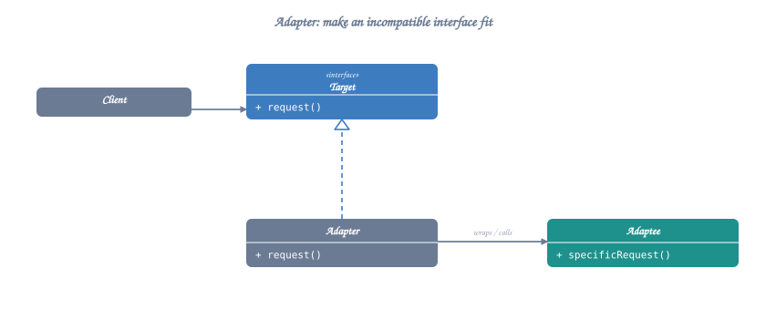
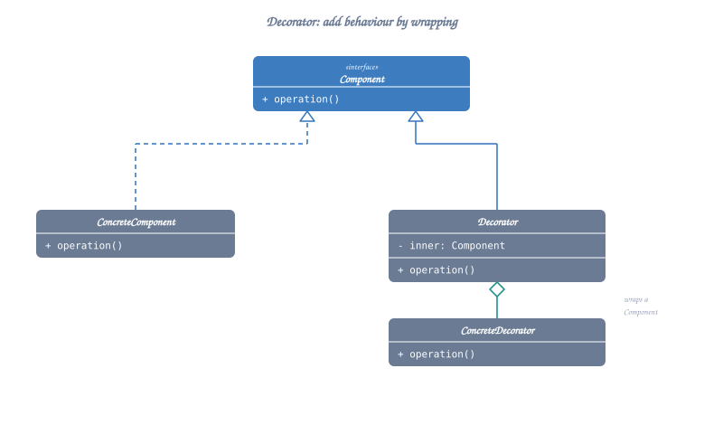
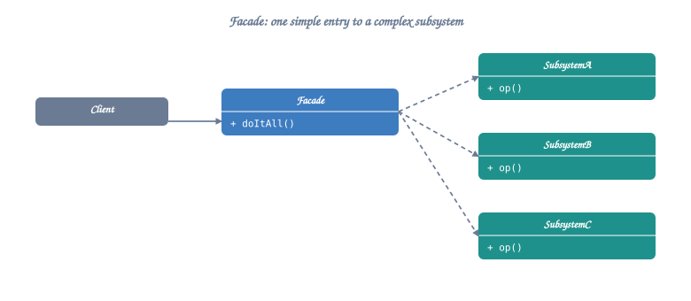
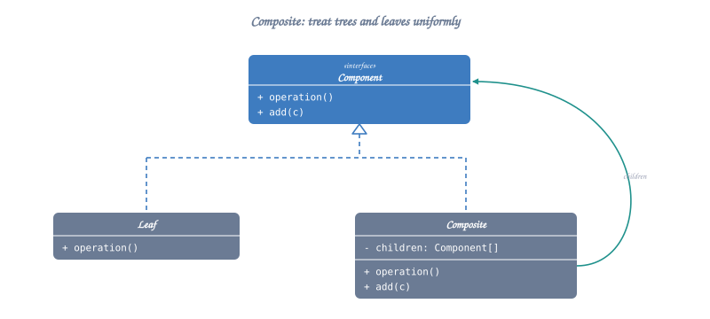
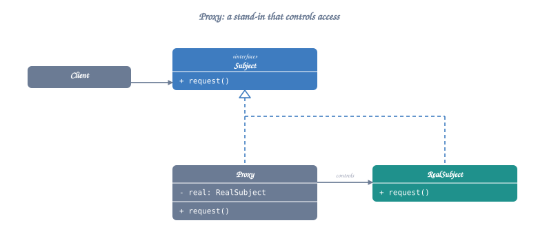
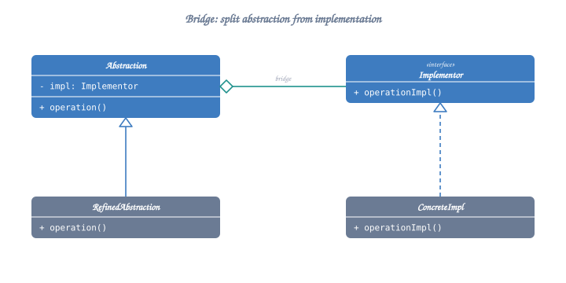
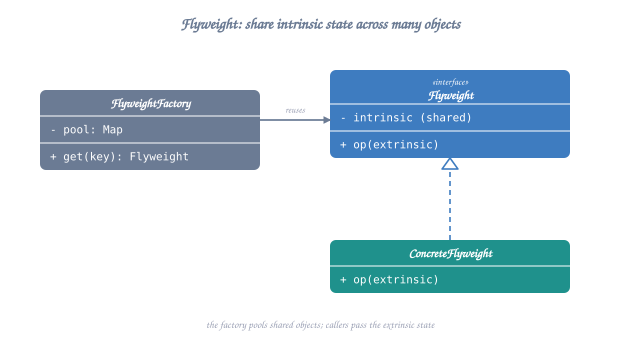

# Structural Design Patterns

Structural patterns deal with object composition, creating relationships between objects to form larger structures while keeping them flexible and efficient.

## Table of Contents
1. [Adapter Pattern](#1-adapter-pattern)
2. [Decorator Pattern](#2-decorator-pattern)
3. [Facade Pattern](#3-facade-pattern)
4. [Composite Pattern](#4-composite-pattern)
5. [Proxy Pattern](#5-proxy-pattern)
6. [Bridge Pattern](#6-bridge-pattern)
7. [Flyweight Pattern](#7-flyweight-pattern)

---

## 1. Adapter Pattern

**Intent**: Convert the interface of a class into another interface clients expect. Adapter lets classes work together that couldn't otherwise because of incompatible interfaces.

**When to Use**:
- Integrate third-party libraries with different interfaces
- Legacy code integration
- Make incompatible interfaces compatible
- Reuse existing classes with incompatible interfaces

### Structure



<details class="ascii-diagram">
<summary>ASCII diagram</summary>
<pre><code>┌─────────────┐         ┌─────────────┐
│   Client    │────────&gt;│   Target    │
└─────────────┘         │ (interface) │
                        ├─────────────┤
                        │ + request() │
                        └──────△──────┘
                               │
                               │
                        ┌──────┴──────┐
                        │   Adapter   │
                        ├─────────────┤
                        │ - adaptee   │
                        ├─────────────┤
                        │ + request() │────┐
                        └─────────────┘    │
                                           │
                                           ▼
                                    ┌─────────────┐
                                    │   Adaptee   │
                                    ├─────────────┤
                                    │+specificReq()│
                                    └─────────────┘</code></pre>
</details>

### C++ Implementation

```cpp
#include <iostream>
#include <memory>
#include <string>

using namespace std;

// Target interface that client expects
class MediaPlayer {
public:
    virtual ~MediaPlayer() = default;
    virtual void play(const string& audioType, const string& fileName) = 0;
};

// Adaptee - Advanced player with different interface
class AdvancedMediaPlayer {
public:
    virtual ~AdvancedMediaPlayer() = default;
    virtual void playVlc(const string& fileName) = 0;
    virtual void playMp4(const string& fileName) = 0;
};

class VlcPlayer : public AdvancedMediaPlayer {
public:
    void playVlc(const string& fileName) override {
        cout << "Playing VLC file: " << fileName << endl;
    }
    
    void playMp4(const string& fileName) override {
        // Do nothing
    }
};

class Mp4Player : public AdvancedMediaPlayer {
public:
    void playVlc(const string& fileName) override {
        // Do nothing
    }
    
    void playMp4(const string& fileName) override {
        cout << "Playing MP4 file: " << fileName << endl;
    }
};

// Adapter - Makes AdvancedMediaPlayer compatible with MediaPlayer
class MediaAdapter : public MediaPlayer {
private:
    unique_ptr<AdvancedMediaPlayer> advancedPlayer;
    
public:
    MediaAdapter(const string& audioType) {
        if (audioType == "vlc") {
            advancedPlayer = make_unique<VlcPlayer>();
        } else if (audioType == "mp4") {
            advancedPlayer = make_unique<Mp4Player>();
        }
    }
    
    void play(const string& audioType, const string& fileName) override {
        if (audioType == "vlc") {
            advancedPlayer->playVlc(fileName);
        } else if (audioType == "mp4") {
            advancedPlayer->playMp4(fileName);
        }
    }
};

// Concrete implementation of target
class AudioPlayer : public MediaPlayer {
private:
    unique_ptr<MediaAdapter> adapter;
    
public:
    void play(const string& audioType, const string& fileName) override {
        if (audioType == "mp3") {
            cout << "Playing MP3 file: " << fileName << endl;
        } else if (audioType == "vlc" || audioType == "mp4") {
            adapter = make_unique<MediaAdapter>(audioType);
            adapter->play(audioType, fileName);
        } else {
            cout << "Invalid media type: " << audioType << endl;
        }
    }
};
```

**Usage Example**:
```cpp
AudioPlayer player;
player.play("mp3", "song.mp3");
player.play("mp4", "video.mp4");
player.play("vlc", "movie.vlc");
```

---

## 2. Decorator Pattern

**Intent**: Attach additional responsibilities to an object dynamically. Decorators provide a flexible alternative to subclassing for extending functionality.

**When to Use**:
- Add responsibilities to objects dynamically
- Responsibilities can be withdrawn
- Extension by subclassing is impractical
- Avoid class explosion from many combinations

### Structure



<details class="ascii-diagram">
<summary>ASCII diagram</summary>
<pre><code>┌─────────────┐
│  Component  │ (interface)
├─────────────┤
│ + operation()│
└──────△──────┘
       │
   ┌───┴───┬──────────────────────┐
   │       │                      │
┌──▼────┐ ┌▼──────────┐    ┌──────▼──────┐
│Concrete││ Decorator │    │   Decorator │
│Component│ (abstract) │    │  ConcreteA  │
└────────┘├───────────┤    ├─────────────┤
          │-component │◄───│  -component │
          │+operation()│    │ +operation()│
          └───────────┘    └─────────────┘</code></pre>
</details>

### C++ Implementation

```cpp
#include <iostream>
#include <memory>
#include <string>

using namespace std;

// Component interface
class Coffee {
public:
    virtual ~Coffee() = default;
    virtual string getDescription() const = 0;
    virtual double getCost() const = 0;
};

// Concrete Component
class SimpleCoffee : public Coffee {
public:
    string getDescription() const override {
        return "Simple Coffee";
    }
    
    double getCost() const override {
        return 2.0;
    }
};

// Decorator base class
class CoffeeDecorator : public Coffee {
protected:
    unique_ptr<Coffee> coffee;
    
public:
    CoffeeDecorator(unique_ptr<Coffee> c) : coffee(move(c)) {}
};

// Concrete Decorator - Milk
class MilkDecorator : public CoffeeDecorator {
public:
    MilkDecorator(unique_ptr<Coffee> c) : CoffeeDecorator(move(c)) {}
    
    string getDescription() const override {
        return coffee->getDescription() + ", Milk";
    }
    
    double getCost() const override {
        return coffee->getCost() + 0.5;
    }
};

// Concrete Decorator - Sugar
class SugarDecorator : public CoffeeDecorator {
public:
    SugarDecorator(unique_ptr<Coffee> c) : CoffeeDecorator(move(c)) {}
    
    string getDescription() const override {
        return coffee->getDescription() + ", Sugar";
    }
    
    double getCost() const override {
        return coffee->getCost() + 0.2;
    }
};

// Concrete Decorator - Whip
class WhipDecorator : public CoffeeDecorator {
public:
    WhipDecorator(unique_ptr<Coffee> c) : CoffeeDecorator(move(c)) {}
    
    string getDescription() const override {
        return coffee->getDescription() + ", Whip";
    }
    
    double getCost() const override {
        return coffee->getCost() + 0.7;
    }
};
```

**Usage Example**:
```cpp
// Simple coffee
unique_ptr<Coffee> coffee = make_unique<SimpleCoffee>();
cout << coffee->getDescription() << " $" << coffee->getCost() << endl;

// Coffee with milk and sugar
coffee = make_unique<SimpleCoffee>();
coffee = make_unique<MilkDecorator>(move(coffee));
coffee = make_unique<SugarDecorator>(move(coffee));
cout << coffee->getDescription() << " $" << coffee->getCost() << endl;

// Coffee with everything
coffee = make_unique<SimpleCoffee>();
coffee = make_unique<MilkDecorator>(move(coffee));
coffee = make_unique<SugarDecorator>(move(coffee));
coffee = make_unique<WhipDecorator>(move(coffee));
cout << coffee->getDescription() << " $" << coffee->getCost() << endl;
```

---

## 3. Facade Pattern

**Intent**: Provide a unified interface to a set of interfaces in a subsystem. Facade defines a higher-level interface that makes the subsystem easier to use.

**When to Use**:
- Simplify complex subsystem interfaces
- Layer your subsystem
- Decouple subsystem from clients
- Provide a simple default view

### Structure



<details class="ascii-diagram">
<summary>ASCII diagram</summary>
<pre><code>┌─────────────┐
│   Client    │
└──────┬──────┘
       │
       ▼
┌─────────────┐
│   Facade    │
├─────────────┤
│ + operation()│────┐
└─────────────┘    │
                   ▼
    ┌──────────────────────────────┐
    │      Subsystem Classes        │
    ├──────────┬──────────┬─────────┤
    │ ClassA   │ ClassB   │ ClassC  │
    └──────────┴──────────┴─────────┘</code></pre>
</details>

### C++ Implementation

```cpp
#include <iostream>
#include <memory>
#include <string>

using namespace std;

// Subsystem classes
class CPU {
public:
    void freeze() {
        cout << "CPU: Freezing..." << endl;
    }
    
    void jump(long position) {
        cout << "CPU: Jumping to position " << position << endl;
    }
    
    void execute() {
        cout << "CPU: Executing..." << endl;
    }
};

class Memory {
public:
    void load(long position, const string& data) {
        cout << "Memory: Loading data '" << data << "' at position " << position << endl;
    }
};

class HardDrive {
public:
    string read(long lba, int size) {
        cout << "HardDrive: Reading " << size << " bytes from sector " << lba << endl;
        return "boot_data";
    }
};

// Facade
class ComputerFacade {
private:
    unique_ptr<CPU> cpu;
    unique_ptr<Memory> memory;
    unique_ptr<HardDrive> hardDrive;
    
    static const long BOOT_ADDRESS = 0x00;
    static const long BOOT_SECTOR = 0;
    static const int SECTOR_SIZE = 512;
    
public:
    ComputerFacade() {
        cpu = make_unique<CPU>();
        memory = make_unique<Memory>();
        hardDrive = make_unique<HardDrive>();
    }
    
    void start() {
        cout << "Starting computer...\n" << endl;
        cpu->freeze();
        string bootData = hardDrive->read(BOOT_SECTOR, SECTOR_SIZE);
        memory->load(BOOT_ADDRESS, bootData);
        cpu->jump(BOOT_ADDRESS);
        cpu->execute();
        cout << "\nComputer started successfully!" << endl;
    }
};
```

**Usage Example**:
```cpp
ComputerFacade computer;
computer.start();  // Simple interface hides complexity
```

---

## 4. Composite Pattern

**Intent**: Compose objects into tree structures to represent part-whole hierarchies. Composite lets clients treat individual objects and compositions uniformly.

**When to Use**:
- Represent part-whole hierarchies
- Ignore difference between individual and composite objects
- Tree structures (file systems, UI components)

### Structure



<details class="ascii-diagram">
<summary>ASCII diagram</summary>
<pre><code>┌─────────────┐
│  Component  │ (interface)
├─────────────┤
│ + operation()│
└──────△──────┘
       │
   ┌───┴───────────┐
   │               │
┌──▼────┐    ┌─────▼─────┐
│ Leaf  │    │ Composite │
├───────┤    ├───────────┤
│+operation│  │ - children│
└───────┘    │ + add()   │
             │ + remove()│
             │+operation()│
             └───────────┘</code></pre>
</details>

### C++ Implementation

```cpp
#include <iostream>
#include <vector>
#include <memory>
#include <string>

using namespace std;

// Component
class FileSystemItem {
protected:
    string name;
    
public:
    FileSystemItem(const string& n) : name(n) {}
    virtual ~FileSystemItem() = default;
    
    virtual void display(int indent = 0) const = 0;
    virtual int getSize() const = 0;
};

// Leaf
class File : public FileSystemItem {
private:
    int size;
    
public:
    File(const string& n, int s) : FileSystemItem(n), size(s) {}
    
    void display(int indent = 0) const override {
        for (int i = 0; i < indent; i++) cout << "  ";
        cout << "File: " << name << " (" << size << " bytes)" << endl;
    }
    
    int getSize() const override {
        return size;
    }
};

// Composite
class Directory : public FileSystemItem {
private:
    vector<unique_ptr<FileSystemItem>> children;
    
public:
    Directory(const string& n) : FileSystemItem(n) {}
    
    void add(unique_ptr<FileSystemItem> item) {
        children.push_back(move(item));
    }
    
    void display(int indent = 0) const override {
        for (int i = 0; i < indent; i++) cout << "  ";
        cout << "Directory: " << name << "/" << endl;
        
        for (const auto& child : children) {
            child->display(indent + 1);
        }
    }
    
    int getSize() const override {
        int total = 0;
        for (const auto& child : children) {
            total += child->getSize();
        }
        return total;
    }
};
```

**Usage Example**:
```cpp
auto root = make_unique<Directory>("root");

auto home = make_unique<Directory>("home");
home->add(make_unique<File>("file1.txt", 100));
home->add(make_unique<File>("file2.txt", 200));

auto docs = make_unique<Directory>("documents");
docs->add(make_unique<File>("doc1.pdf", 500));
docs->add(make_unique<File>("doc2.pdf", 300));

home->add(move(docs));
root->add(move(home));

root->display();
cout << "Total size: " << root->getSize() << " bytes" << endl;
```

---

## 5. Proxy Pattern

**Intent**: Provide a surrogate or placeholder for another object to control access to it.

**When to Use**:
- Lazy initialization (Virtual Proxy)
- Access control (Protection Proxy)
- Remote object access (Remote Proxy)
- Logging, caching (Smart Proxy)

### Types of Proxies

1. **Virtual Proxy**: Delays expensive object creation
2. **Protection Proxy**: Controls access based on permissions
3. **Remote Proxy**: Represents object in different address space
4. **Smart Proxy**: Additional actions when accessing object

### Structure



<details class="ascii-diagram">
<summary>ASCII diagram</summary>
<pre><code>┌─────────────┐        ┌─────────────┐
│   Client    │───────&gt;│   Subject   │
└─────────────┘        │ (interface) │
                       ├─────────────┤
                       │ + request() │
                       └──────△──────┘
                              │
                      ┌───────┴───────┐
                      │               │
               ┌──────▼─────┐  ┌──────▼─────┐
               │    Proxy   │  │ RealSubject│
               ├────────────┤  ├────────────┤
               │-realSubject│─&gt;│ + request()│
               │ + request()│  └────────────┘
               └────────────┘</code></pre>
</details>

### C++ Implementation (Virtual Proxy)

```cpp
#include <iostream>
#include <memory>
#include <string>

using namespace std;

// Subject interface
class Image {
public:
    virtual ~Image() = default;
    virtual void display() = 0;
};

// Real Subject - Expensive to create
class RealImage : public Image {
private:
    string filename;
    
    void loadFromDisk() {
        cout << "Loading image from disk: " << filename << endl;
        // Simulate expensive operation
    }
    
public:
    RealImage(const string& fname) : filename(fname) {
        loadFromDisk();
    }
    
    void display() override {
        cout << "Displaying image: " << filename << endl;
    }
};

// Proxy - Delays creation
class ImageProxy : public Image {
private:
    string filename;
    mutable unique_ptr<RealImage> realImage;  // Lazy initialization
    
public:
    ImageProxy(const string& fname) : filename(fname) {}
    
    void display() override {
        if (!realImage) {
            realImage = make_unique<RealImage>(filename);
        }
        realImage->display();
    }
};
```

**Usage Example**:
```cpp
// Image is not loaded yet
unique_ptr<Image> image = make_unique<ImageProxy>("photo.jpg");

cout << "Image created, but not loaded yet\n" << endl;

// Image is loaded now
image->display();

// Image already loaded, no reload needed
image->display();
```

### Protection Proxy Example

```cpp
class Document {
public:
    virtual ~Document() = default;
    virtual void read() = 0;
    virtual void write(const string& content) = 0;
};

class RealDocument : public Document {
private:
    string content;
    
public:
    void read() override {
        cout << "Reading document: " << content << endl;
    }
    
    void write(const string& c) override {
        content = c;
        cout << "Document written" << endl;
    }
};

class ProtectedDocument : public Document {
private:
    unique_ptr<RealDocument> realDoc;
    string userRole;
    
public:
    ProtectedDocument(const string& role) : userRole(role) {
        realDoc = make_unique<RealDocument>();
    }
    
    void read() override {
        realDoc->read();  // Everyone can read
    }
    
    void write(const string& content) override {
        if (userRole == "admin" || userRole == "editor") {
            realDoc->write(content);
        } else {
            cout << "Access denied! You don't have write permissions." << endl;
        }
    }
};
```

---

## 6. Bridge Pattern

**Intent**: Decouple an abstraction from its implementation so that the two can vary independently.

**When to Use**:
- Avoid permanent binding between abstraction and implementation
- Both abstraction and implementation should be extensible
- Changes in implementation shouldn't affect clients

### Structure



<details class="ascii-diagram">
<summary>ASCII diagram</summary>
<pre><code>┌──────────────┐          ┌──────────────┐
│ Abstraction  │─────────&gt;│Implementor   │
├──────────────┤          │ (interface)  │
│-implementor  │          ├──────────────┤
│ + operation()│          │+operationImpl│
└──────△───────┘          └──────△───────┘
       │                         │
       │                    ┌────┴────┐
       │                    │         │
┌──────▼────────┐  ┌────────▼───┐ ┌───▼────────┐
│RefinedAbstraction│ConcreteImpl│ │ConcreteImpl│
└───────────────┘  │     A      │ │     B      │
                   └────────────┘ └────────────┘</code></pre>
</details>

### C++ Implementation

```cpp
#include <iostream>
#include <memory>

using namespace std;

// Implementor
class DrawingAPI {
public:
    virtual ~DrawingAPI() = default;
    virtual void drawCircle(double x, double y, double radius) = 0;
};

// Concrete Implementor A
class DrawingAPI1 : public DrawingAPI {
public:
    void drawCircle(double x, double y, double radius) override {
        cout << "API1: Drawing circle at (" << x << "," << y
             << ") with radius " << radius << endl;
    }
};

// Concrete Implementor B
class DrawingAPI2 : public DrawingAPI {
public:
    void drawCircle(double x, double y, double radius) override {
        cout << "API2: Drawing circle at (" << x << "," << y
             << ") with radius " << radius << endl;
    }
};

// Abstraction
class Shape {
protected:
    unique_ptr<DrawingAPI> drawingAPI;
    
public:
    Shape(unique_ptr<DrawingAPI> api) : drawingAPI(move(api)) {}
    virtual ~Shape() = default;
    virtual void draw() = 0;
    virtual void resizeByPercentage(double pct) = 0;
};

// Refined Abstraction
class CircleShape : public Shape {
private:
    double x, y, radius;
    
public:
    CircleShape(double x, double y, double r, unique_ptr<DrawingAPI> api)
        : Shape(move(api)), x(x), y(y), radius(r) {}
    
    void draw() override {
        drawingAPI->drawCircle(x, y, radius);
    }
    
    void resizeByPercentage(double pct) override {
        radius *= (1.0 + pct / 100.0);
    }
};
```

**Usage Example**:
```cpp
unique_ptr<Shape> circle1 = make_unique<CircleShape>(
    1, 2, 3, make_unique<DrawingAPI1>());
unique_ptr<Shape> circle2 = make_unique<CircleShape>(
    5, 7, 11, make_unique<DrawingAPI2>());

circle1->draw();
circle2->draw();

circle1->resizeByPercentage(50);
circle1->draw();
```

---

## 7. Flyweight Pattern

**Intent**: Use sharing to support large numbers of fine-grained objects efficiently.

**When to Use**:
- Application uses large number of objects
- Storage costs are high due to quantity
- Most object state can be made extrinsic
- Many objects can be replaced by fewer shared objects

### Structure



<details class="ascii-diagram">
<summary>ASCII diagram</summary>
<pre><code>┌─────────────┐
│   Client    │
└──────┬──────┘
       │
       ▼
┌──────────────────┐
│FlyweightFactory  │
├──────────────────┤
│ - flyweights     │
│ + getFlyweight() │
└──────┬───────────┘
       │ creates
       ▼
┌──────────────┐
│  Flyweight   │
├──────────────┤
│+ operation() │
└──────────────┘</code></pre>
</details>

### C++ Implementation

```cpp
#include <iostream>
#include <map>
#include <memory>
#include <string>

using namespace std;

// Flyweight - Shared intrinsic state
class CharacterStyle {
private:
    string font;
    int size;
    string color;
    
public:
    CharacterStyle(const string& f, int s, const string& c)
        : font(f), size(s), color(c) {
        cout << "Creating style: " << font << " " << size << " " << color << endl;
    }
    
    void display(char character) const {
        cout << "Char '" << character << "' in " << font
             << " " << size << "pt " << color << endl;
    }
};

// Flyweight Factory
class StyleFactory {
private:
    map<string, shared_ptr<CharacterStyle>> styles;
    
    string getKey(const string& font, int size, const string& color) {
        return font + "_" + to_string(size) + "_" + color;
    }
    
public:
    shared_ptr<CharacterStyle> getStyle(const string& font, int size, const string& color) {
        string key = getKey(font, size, color);
        
        if (styles.find(key) == styles.end()) {
            styles[key] = make_shared<CharacterStyle>(font, size, color);
        }
        
        return styles[key];
    }
    
    int getStyleCount() const {
        return styles.size();
    }
};

// Client
class Character {
private:
    char character;  // Extrinsic state
    shared_ptr<CharacterStyle> style;  // Intrinsic state (shared)
    
public:
    Character(char c, shared_ptr<CharacterStyle> s)
        : character(c), style(s) {}
    
    void display() const {
        style->display(character);
    }
};
```

**Usage Example**:
```cpp
StyleFactory factory;

// Create many characters with few styles
vector<Character> document;

// Same style used for multiple characters
auto arial12Red = factory.getStyle("Arial", 12, "Red");
document.push_back(Character('H', arial12Red));
document.push_back(Character('e', arial12Red));
document.push_back(Character('l', arial12Red));
document.push_back(Character('l', arial12Red));
document.push_back(Character('o', arial12Red));

auto times14Blue = factory.getStyle("Times", 14, "Blue");
document.push_back(Character('W', times14Blue));
document.push_back(Character('o', times14Blue));
document.push_back(Character('r', times14Blue));
document.push_back(Character('l', times14Blue));
document.push_back(Character('d', times14Blue));

// Display all characters
for (const auto& ch : document) {
    ch.display();
}

cout << "\nTotal styles created: " << factory.getStyleCount() << endl;
cout << "Total characters: " << document.size() << endl;
```

---

## Pattern Comparison

| Pattern | Purpose | Key Benefit |
|---------|---------|-------------|
| **Adapter** | Interface conversion | Makes incompatible interfaces work together |
| **Decorator** | Add responsibilities | Dynamic feature addition without subclassing |
| **Facade** | Simplified interface | Hide subsystem complexity |
| **Composite** | Tree structures | Treat individual/composite objects uniformly |
| **Proxy** | Controlled access | Lazy loading, access control, remote access |
| **Bridge** | Decouple abstraction | Independent variation of abstraction & implementation |
| **Flyweight** | Share objects | Reduce memory usage with many similar objects |

---

## When to Use Which Pattern?

### Choose Adapter when:
- You have existing class with wrong interface
- You want to reuse incompatible code

### Choose Decorator when:
- You need to add responsibilities dynamically
- Subclassing would create too many classes

### Choose Facade when:
- You have complex subsystem to simplify
- You want to layer your architecture

### Choose Composite when:
- You have tree/hierarchical structures
- You want to treat parts and whole uniformly

### Choose Proxy when:
- You need lazy initialization
- You need access control
- You need logging/caching

### Choose Bridge when:
- You want to avoid permanent binding
- Both abstraction and implementation need to vary

### Choose Flyweight when:
- You have many similar objects
- Memory is a concern

---

## Real-World Usage in Problems

**Adapter**: Payment gateway integration, third-party APIs  
**Decorator**: Logger levels, coffee shop, feature flags  
**Facade**: Computer startup, Home theater system  
**Composite**: File system, UI component hierarchy  
**Proxy**: Image loading, security proxy, caching  
**Bridge**: Drawing APIs, device drivers  
**Flyweight**: Text editor characters, game particles  

---

**Next**: `03-behavioral-patterns.md`

